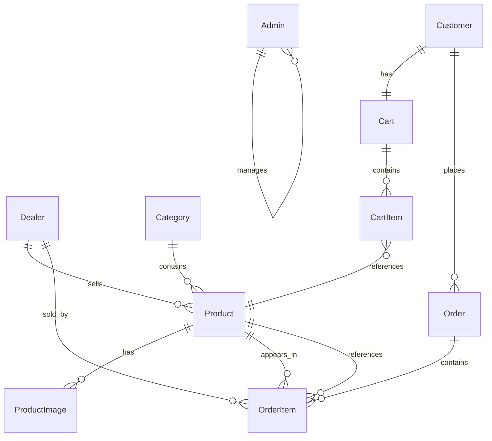

# 03 — Database Design

## ER Diagram

---

## Table Specifications

### Admin
Stores admin user accounts. Separate from other roles for security.

| Column | Type | Constraints | Description |
|--------|------|-------------|-------------|
| Id | UUID | PK | Primary key |
| Email | VARCHAR(256) | UNIQUE, NOT NULL | Login identifier |
| PasswordHash | TEXT | NOT NULL | BCrypt hashed password |
| FullName | VARCHAR(256) | NOT NULL | Display name |
| Phone | VARCHAR(32) | NULLABLE | Contact phone |
| IsActive | BOOLEAN | NOT NULL, DEFAULT true | Account status |
| CreatedAt | TIMESTAMP | NOT NULL, DEFAULT now() | Account creation |
| UpdatedAt | TIMESTAMP | NOT NULL, DEFAULT now() | Last update |

**Indexes:** Email (unique)

### Dealer
Dealer accounts with integrated shop information.

| Column | Type | Constraints | Description |
|--------|------|-------------|-------------|
| Id | UUID | PK | Primary key |
| Email | VARCHAR(256) | UNIQUE, NOT NULL | Login identifier |
| PasswordHash | TEXT | NOT NULL | BCrypt hashed password |
| FullName | VARCHAR(256) | NOT NULL | Owner display name |
| Phone | VARCHAR(32) | NULLABLE | Contact phone |
| ShopName | VARCHAR(256) | NOT NULL | Shop display name |
| ShopDescription | TEXT | NULLABLE | Shop bio |
| ShopCategory | VARCHAR(128) | NOT NULL | Primary category |
| Address | TEXT | NOT NULL | Shop address |
| LogoUrl | TEXT | NULLABLE | Logo image URL |
| IsApproved | BOOLEAN | NOT NULL, DEFAULT false | Dealer approval status |
| IsActive | BOOLEAN | NOT NULL, DEFAULT true | Account status |
| CreatedAt | TIMESTAMP | NOT NULL, DEFAULT now() | Account creation |
| UpdatedAt | TIMESTAMP | NOT NULL, DEFAULT now() | Last update |

**Indexes:** Email (unique)

### Customer
Customer accounts.

| Column | Type | Constraints | Description |
|--------|------|-------------|-------------|
| Id | UUID | PK | Primary key |
| Email | VARCHAR(256) | UNIQUE, NOT NULL | Login identifier |
| PasswordHash | TEXT | NOT NULL | BCrypt hashed password |
| FullName | VARCHAR(256) | NOT NULL | Display name |
| Phone | VARCHAR(32) | NULLABLE | Contact phone |
| IsActive | BOOLEAN | NOT NULL, DEFAULT true | Account status |
| CreatedAt | TIMESTAMP | NOT NULL, DEFAULT now() | Account creation |
| UpdatedAt | TIMESTAMP | NOT NULL, DEFAULT now() | Last update |

**Indexes:** Email (unique)

### Category
Product categories with optional parent for subcategories.

| Column | Type | Constraints | Description |
|--------|------|-------------|-------------|
| Id | UUID | PK | Primary key |
| Name | VARCHAR(128) | UNIQUE, NOT NULL | Category name |
| Description | TEXT | NULLABLE | Category description |
| ParentCategoryId | UUID | FK → Category(Id), NULLABLE | Parent category |

**Indexes:** Name (unique)

### Product
Products listed by dealers. Starts Pending until Admin approves.

| Column | Type | Constraints | Description |
|--------|------|-------------|-------------|
| Id | UUID | PK | Primary key |
| DealerId | UUID | FK → Dealer(Id), NOT NULL | Seller |
| CategoryId | UUID | FK → Category(Id), NOT NULL | Category |
| Name | VARCHAR(256) | NOT NULL | Product name |
| Description | TEXT | NULLABLE | Product description |
| Price | DECIMAL(10,2) | NOT NULL | Unit price |
| StockQuantity | INTEGER | NOT NULL, DEFAULT 0 | Available stock |
| SKU | VARCHAR(128) | NULLABLE | Stock keeping unit |
| ApprovalStatus | VARCHAR(50) | NOT NULL, DEFAULT 'Pending' | Pending/Approved/Rejected/Unpublished (stored as string) |
| RejectionReason | TEXT | NULLABLE | Reason if rejected |
| CreatedAt | TIMESTAMP | NOT NULL, DEFAULT now() | Creation date |
| UpdatedAt | TIMESTAMP | NOT NULL, DEFAULT now() | Last update |
| PublishedAt | TIMESTAMP | NULLABLE | When approved |

**Indexes:** (ApprovalStatus, CategoryId), DealerId, SKU

### ProductImage
Multiple images per product with display order.

| Column | Type | Constraints | Description |
|--------|------|-------------|-------------|
| Id | UUID | PK | Primary key |
| ProductId | UUID | FK → Product(Id), NOT NULL | Parent product |
| ImageUrl | TEXT | NOT NULL | Image URL |
| DisplayOrder | INTEGER | NOT NULL, DEFAULT 0 | Sort order |

### Cart
One active cart per customer.

| Column | Type | Constraints | Description |
|--------|------|-------------|-------------|
| Id | UUID | PK | Primary key |
| CustomerId | UUID | FK → Customer(Id), UNIQUE, NOT NULL | Owner |
| CreatedAt | TIMESTAMP | NOT NULL, DEFAULT now() | Creation date |
| UpdatedAt | TIMESTAMP | NOT NULL, DEFAULT now() | Last modification |

### CartItem
Items in a cart.

| Column | Type | Constraints | Description |
|--------|------|-------------|-------------|
| Id | UUID | PK | Primary key |
| CartId | UUID | FK → Cart(Id), NOT NULL | Parent cart |
| ProductId | UUID | FK → Product(Id), NOT NULL | Product reference |
| Quantity | INTEGER | NOT NULL, DEFAULT 1 | Item quantity |
| PriceAtAdd | DECIMAL(10,2) | NOT NULL | Price snapshot at add time |

**Unique constraint:** (CartId, ProductId)

### Order
Customer orders with server-calculated totals.

| Column | Type | Constraints | Description |
|--------|------|-------------|-------------|
| Id | UUID | PK | Primary key |
| CustomerId | UUID | FK → Customer(Id), NOT NULL | Buyer |
| Status | VARCHAR(50) | NOT NULL, DEFAULT 'Pending' | Order status (stored as string) |
| TotalAmount | DECIMAL(12,2) | NOT NULL | Server-calculated total |
| ShippingAddress | TEXT | NOT NULL | Delivery address snapshot |
| CreatedAt | TIMESTAMP | NOT NULL, DEFAULT now() | Order date |
| UpdatedAt | TIMESTAMP | NOT NULL, DEFAULT now() | Last status change |

### OrderItem
Line items in an order. Dealer reference denormalized for fast queries.

| Column | Type | Constraints | Description |
|--------|------|-------------|-------------|
| Id | UUID | PK | Primary key |
| OrderId | UUID | FK → Order(Id), NOT NULL | Parent order |
| ProductId | UUID | FK → Product(Id), NOT NULL | Product reference |
| DealerId | UUID | FK → Dealer(Id), NOT NULL | Seller (denormalized) |
| Quantity | INTEGER | NOT NULL | Units ordered |
| UnitPriceAtPurchase | DECIMAL(10,2) | NOT NULL | Price at time of order |
| Subtotal | DECIMAL(12,2) | NOT NULL | Quantity × UnitPrice |

---

## Relationship Rules

| Relationship | Type | Notes |
|--------------|------|-------|
| Dealer → Product | 1:N | Dealer owns products |
| Category → Product | 1:N | Product belongs to one category |
| Product → ProductImage | 1:N | Product has images |
| Customer → Cart | 1:1 | One active cart per customer |
| Cart → CartItem | 1:N | Cart contains items |
| Customer → Order | 1:N | Customer places orders |
| Order → OrderItem | 1:N | Order has line items |
| Product → OrderItem | 1:N | Product appears in orders |
| Dealer → OrderItem | 1:N | Dealer sells items (via OrderItem.DealerId) |

---

## Implementation Notes

- Schema is managed via SQL scripts (`SQL/database.sql`) on Supabase cloud
- Table names use lowercase (e.g., `admins`, `dealers`, `customers`, `products`)
- Fluent API configurations in `ECommerce.Infrastructure/Data/Configurations/`
- OrderStatus and ApprovalStatus stored as VARCHAR with EF Core HasConversion
- Database seeded via SQL scripts, not code-based seeder

---

## Seed Data Summary

| Entity | Count | Notes |
|--------|-------|-------|
| Admins | 1 | admin@ecommerce.com |
| Dealers | 10 | 8 approved, 2 pending, various categories |
| Customers | 10 | All active |
| Categories | 8 | Electronics, Clothing, Home & Garden, Books, Sports, Beauty, Automotive, Food & Beverage |
| Products | 550 | 50 per dealer, mix of Approved/Pending/Rejected |
| Orders | 57 | Across multiple customers with order items |
| Product Images | 550 | One image per product |
