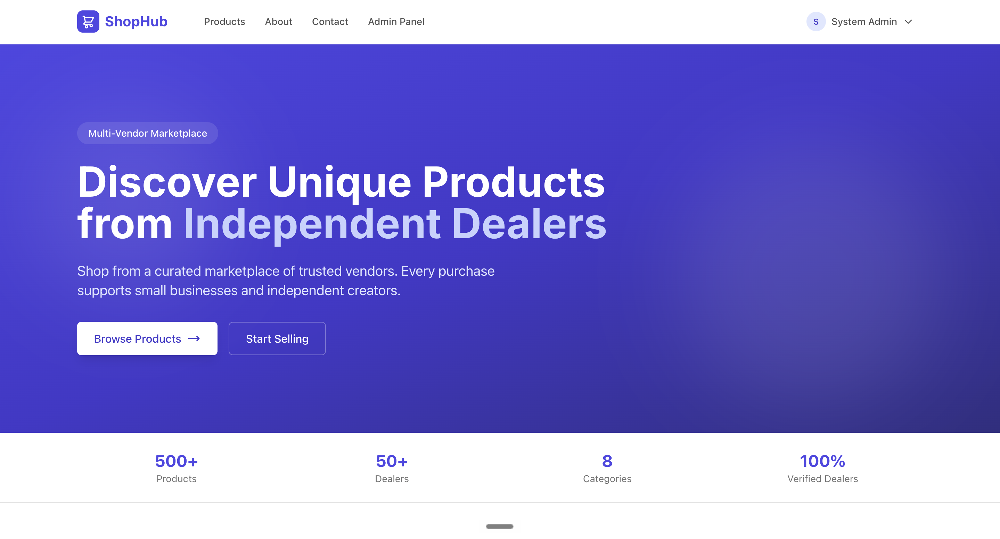

# Multi-Vendor E-Commerce Platform



A production-quality multi-vendor e-commerce web application built with **C# / ASP.NET Core** (backend) and **Next.js + TypeScript** (frontend), using **PostgreSQL** as the database.

## Team Members

This project is a collaborative effort by four students from the **Department of Computer Science and Engineering (CSC)** at **IUBAT**.

| Name | Role / Contribution |
|------|---------------------|
| **@dev.pranto (Md. Pranto Islam)** | Lead Developer — UI Frontend & Core Backend Architecture |
| **Arshi** | *[Please update with specific contribution]* |
| **Shoriful Shakil** | *[Please update with specific contribution]* |
| **Lithi** | *[Please update with specific contribution]* |
## Features

- **Three Roles:** Admin, Dealer (vendor), Customer
- **Dealer Shops:** Dealers register their own shop and manage product catalogs
- **Product Approval Workflow:** New dealer products start hidden and require Admin approval before public visibility
- **Customer Storefront:** Browse, search, filter, sort approved products; cart and checkout
- **Admin Oversight:** Full platform management — users, dealers, products, categories, orders, approvals, statistics
- **Dealer Management:** Admin can filter, add, edit, and delete dealers from the admin dashboard
- **Comprehensive Demo Data:** 500 products, 56 orders, 21 users for realistic testing
- **Role-Based Authorization:** Every endpoint enforces ownership and role checks server-side

## Tech Stack

| Layer | Technology |
|-------|-----------|
| Backend | C# / ASP.NET Core Web API |
| ORM | Entity Framework Core 9.0 |
| Database | PostgreSQL |
| Auth | JWT + BCrypt password hashing |
| Frontend | Next.js 14+ (App Router) + TypeScript + React |
| Styling | Tailwind CSS |
| API Docs | Swagger / OpenAPI |

## Project Structure

```
C-Project/
├── backend/                    # ASP.NET Core Web API
│   ├── src/
│   │   ├── ECommerce.API/              # Presentation layer
│   │   ├── ECommerce.Application/      # Business logic
│   │   ├── ECommerce.Domain/           # Entities & interfaces
│   │   └── ECommerce.Infrastructure/   # EF Core & repositories
├── frontend/                   # Next.js application
│   ├── app/                    # App Router pages
│   ├── components/             # Shared UI components
│   ├── features/               # Feature modules
│   ├── services/               # API client
│   ├── types/                  # TypeScript types
│   └── lib/                    # Utilities
└── Documents/                  # Project documentation (10 files)
```

## Quick Start

### 1. Database Setup

```bash
psql -U md.prantoislam -c "CREATE DATABASE ecommerce_db;"
```

### 2. Backend Setup

```bash
cd backend
dotnet restore
cd src/ECommerce.API
ASPNETCORE_ENVIRONMENT=Development dotnet run --urls "http://localhost:5001"
```

### 3. Frontend Setup

```bash
cd frontend
npm install
npm run dev
```

### 4. Demo Login

Use the following credentials to test the different user roles in the application.

#### Admin Account

| Field | Details |
|-------|---------|
| **Email** | `admin@ecommerce.com` |
| **Password** | `Admin@123` |
| **Status** | ✅ Verified |

#### Dealer Account

| Field | Details |
|-------|---------|
| **Email** | `dealer1@test.com` |
| **Password** | `Dealer@123` |
| **Status** | ✅ Verified |

#### Customer Account

| Field | Details |
|-------|---------|
| **Email** | `customer1@test.com` |
| **Password** | `Customer@123` |
| **Status** | ✅ Verified |


Admin:    admin@ecommerce.com / Admin@123
-- Dealer:   dealer1@test.com    / Dealer@123 (Alex Tech)
-- Customer: customer1@test.com  / Customer@123 (John Buyer)

> **Note:** Demo credentials are intended for development and testing only. Replace them with secure credentials before deploying to production.

> 10 seeded dealers (Dealer@123) and 10 seeded customers (Customer@123) also available. See [Documents/06-DEMO-CREDENTIALS.md](./Documents/06-DEMO-CREDENTIALS.md) for full list.

## Fix Error
bash start.sh


## Run All In One Command

cd /Users/md.prantoislam/Desktop/C-Project
./start.sh


## Documentation

All project documentation is in the [Documents/](./Documents/) folder:

| File | Purpose |
|------|---------|
| [INDEX.md](./Documents/INDEX.md) | Documentation index and navigation guide |
| [01-PROJECT-OVERVIEW.md](./Documents/01-PROJECT-OVERVIEW.md) | Project description, objectives, tech stack |
| [02-ARCHITECTURE.md](./Documents/02-ARCHITECTURE.md) | System architecture, layer responsibilities |
| [03-DATABASE-DESIGN.md](./Documents/03-DATABASE-DESIGN.md) | ER diagram, table schemas, seed data |
| [04-API-REFERENCE.md](./Documents/04-API-REFERENCE.md) | All API endpoints with examples |
| [05-FRONTEND-GUIDE.md](./Documents/05-FRONTEND-GUIDE.md) | Pages, routes, components |
| [06-DEMO-CREDENTIALS.md](./Documents/06-DEMO-CREDENTIALS.md) | All test accounts |
| [07-SETUP-GUIDE.md](./Documents/07-SETUP-GUIDE.md) | How to install and run |
| [08-PROGRESS-LOG.md](./Documents/08-PROGRESS-LOG.md) | Development history |
| [09-KNOWN-ISSUES.md](./Documents/09-KNOWN-ISSUES.md) | Bugs, limitations, TODOs |
| [10-HANDOVER.md](./Documents/10-HANDOVER.md) | AI agent / new developer handover |
