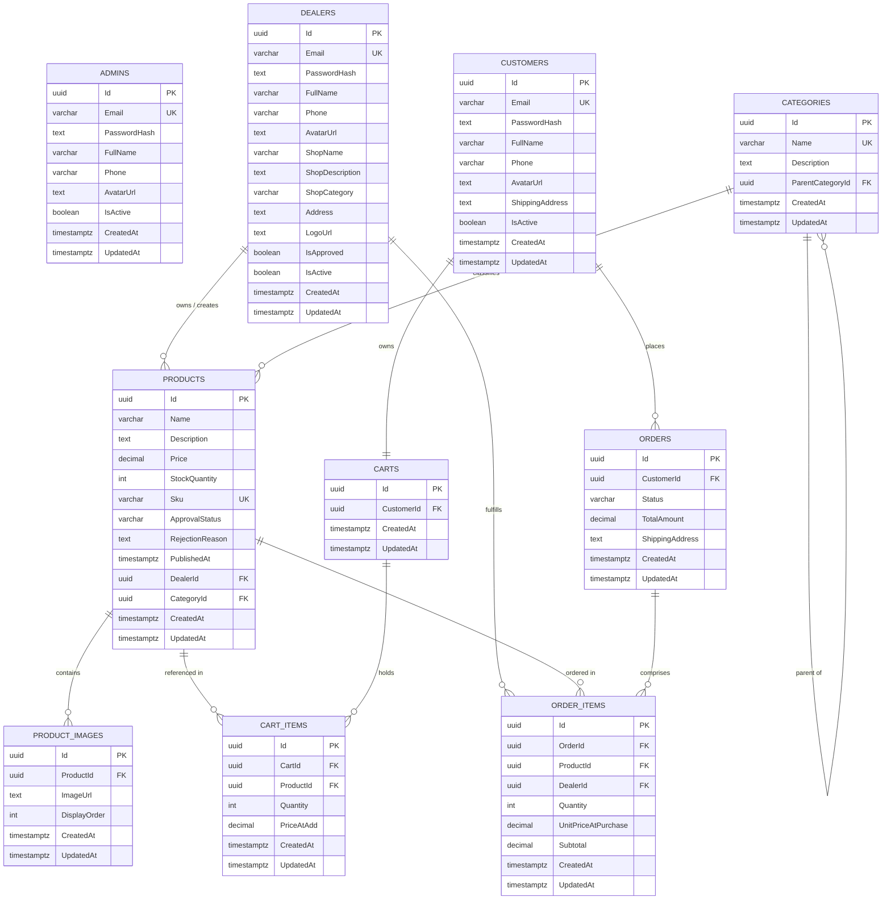

# MULTI-VENDOR E-COMMERCE PLATFORM
## Comprehensive Final Project Report & Architectural Documentation

**Project Title:** Multi-Vendor E-Commerce Platform with Dealer Product Approval Workflow  
**Project Category:** Full-Stack Enterprise Web Application / University Final Year Capstone Project  
**Author / Developer:** md.prantoislam  
**Backend Framework:** ASP.NET Core Web API (.NET 9.0)  
**Frontend Framework:** Next.js 14 (App Router, TypeScript, Tailwind CSS)  
**Database System:** PostgreSQL 14+ on Supabase Cloud  
**Completion Date:** September 15, 2026  
**Project Status:** 100% Feature-Complete & Production-Ready  

---

## Executive Summary

The **Multi-Vendor E-Commerce Platform** is an enterprise-grade digital marketplace application designed to provide a secure, scalable, and intuitive environment where multiple independent merchants (dealers) can market and sell their goods while end-users (customers) can discover, purchase, and track products across diverse categories. 

A central architectural differentiator of this platform is the **Dealer Product Approval Workflow**. Unlike open unmoderated marketplaces where counterfeit, duplicate, or inappropriate product listings harm consumer confidence, this platform enforces a formal quality-control gatekeeper: every newly drafted product by a vendor begins in a `Pending` state and remains strictly concealed from the public storefront until verified, reviewed, and approved by a platform Administrator.

The application is architected around the principles of **Clean Architecture** (Onion Architecture) in .NET 9.0, maintaining strict boundary separation between Domain, Application, Infrastructure, and Presentation layers. The backend exposes over 35 RESTful endpoints authenticated via stateless JSON Web Tokens (JWT) with BCrypt-hashed credentials. The persistence layer leverages **PostgreSQL on Supabase Cloud** through Entity Framework Core 9.0, utilizing a role-segregated 10-table schema that eliminates single-table collision and guarantees multi-tenant data privacy. 

The frontend is constructed using **Next.js 14 with the App Router**, React 18, TypeScript, and Tailwind CSS. It features custom UI components including client-side image encoding (`ImageUploadInput`), multi-stage animated loading indicators (`LoadingProgress`), extended modal dialogs, real-time cart state management, and role-guarded workspaces for Administrators, Dealers, and Customers.

---

# Table of Contents

- [Chapter 1: Introduction](#chapter-1-introduction)
  - [1.1 Project Background](#11-project-background)
  - [1.2 Problem Statement](#12-problem-statement)
  - [1.3 Objectives](#13-objectives)
  - [1.4 Scope of the Project](#14-scope-of-the-project)
  - [1.5 Report Organization](#15-report-organization)
- [Chapter 2: Literature Review & Technology Overview](#chapter-2-literature-review--technology-overview)
  - [2.1 ASP.NET Core and .NET 9.0](#21-aspnet-core-and-net-90)
  - [2.2 Entity Framework Core 9.0 & Npgsql](#22-entity-framework-core-90--npgsql)
  - [2.3 PostgreSQL & Supabase Cloud Architecture](#23-postgresql--supabase-cloud-architecture)
  - [2.4 Next.js 14 (App Router Architecture)](#24-nextjs-14-app-router-architecture)
  - [2.5 TypeScript and React 18](#25-typescript-and-react-18)
  - [2.6 Tailwind CSS & Custom Design System](#26-tailwind-css--custom-design-system)
  - [2.7 JWT (JSON Web Token) Security Architecture](#27-jwt-json-web-token-security-architecture)
  - [2.8 BCrypt Cryptographic Password Hashing](#28-bcrypt-cryptographic-password-hashing)
  - [2.9 Clean Architecture Pattern](#29-clean-architecture-pattern)
  - [2.10 RESTful API Principles](#210-restful-api-principles)
- [Chapter 3: System Analysis and Design](#chapter-3-system-analysis-and-design)
  - [3.1 Requirements Analysis](#31-requirements-analysis)
  - [3.2 System Architecture](#32-system-architecture)
  - [3.3 Database Design & Entity Relationship Modeling](#33-database-design--entity-relationship-modeling)
  - [3.4 API Architecture & Route Catalog](#34-api-architecture--route-catalog)
  - [3.5 UI/UX Design System & Layouts](#35-uiux-design-system--layouts)
- [Chapter 4: Implementation](#chapter-4-implementation)
  - [4.1 Development Environment & Tooling](#41-development-environment--tooling)
  - [4.2 Database Implementation & Seeding Strategy](#42-database-implementation--seeding-strategy)
  - [4.3 Backend Implementation (.NET 9.0 Clean Architecture, MVC & Routing Engine)](#43-backend-implementation-net-90-clean-architecture-mvc--routing-engine)
    - [4.3.1 Domain Layer (`ECommerce.Domain`)](#431-domain-layer-ecommercedomain)
    - [4.3.2 Infrastructure Layer (`ECommerce.Infrastructure`)](#432-infrastructure-layer-ecommerceinfrastructure)
    - [4.3.3 Application Layer (`ECommerce.Application`)](#433-application-layer-ecommerceapplication)
    - [4.3.4 Presentation Layer (`ECommerce.API`) & MVC Pattern in Web API](#434-presentation-layer-ecommerceapi--mvc-pattern-in-web-api)
    - [4.3.5 Comprehensive Routing Management (Attribute Routing, Templates, Tokens & Model Binding)](#435-comprehensive-routing-management-attribute-routing-templates-tokens--model-binding)
    - [4.3.6 HTTP Middleware Pipeline & Centralized Global Exception Handling](#436-http-middleware-pipeline--centralized-global-exception-handling)
    - [4.3.7 Request Handlers: JWT Authentication, Role Authorization, CORS & FluentValidation](#437-request-handlers-jwt-authentication-role-authorization-cors--fluentvalidation)
  - [4.4 Frontend Implementation & Backend Connection Architecture](#44-frontend-implementation--backend-connection-architecture)
    - [4.4.1 Directory Layout & Next.js 14 App Router](#441-directory-layout--nextjs-14-app-router)
    - [4.4.2 Axios Client Configuration & Centralized Base URL](#442-axios-client-configuration--centralized-base-url)
    - [4.4.3 Request Interceptor: Automated Bearer Token Injection](#443-request-interceptor-automated-bearer-token-injection)
    - [4.4.4 Response Interceptor: Silent Token Refresh & Resilient Session Recovery](#444-response-interceptor-silent-token-refresh--resilient-session-recovery)
    - [4.4.5 Modular API Service Architecture](#445-modular-api-service-architecture)
    - [4.4.6 End-to-End Request-Response Sequence Trace (User Click to Database Commit)](#446-end-to-end-request-response-sequence-trace-user-click-to-database-commit)
  - [4.5 Critical Business Paths Analysis](#45-critical-business-paths-analysis)
    - [4.5.1 Critical Path 1: Authentication & Token Lifecycle](#451-critical-path-1-authentication--token-lifecycle)
    - [4.5.2 Critical Path 2: Atomic Checkout & Order Stock Transaction](#452-critical-path-2-atomic-checkout--order-stock-transaction)
    - [4.5.3 Critical Path 3: Multi-tenant Dealer Product Lifecycle & Admin Approval Workflow](#453-critical-path-3-multi-tenant-dealer-product-lifecycle--admin-approval-workflow)
    - [4.5.4 Critical Path 4: Zero-Trust Multi-Tenant Isolation & Role Boundaries](#454-critical-path-4-zero-trust-multi-tenant-isolation--role-boundaries)
- [Chapter 5: Testing, Verification & Results](#chapter-5-testing-verification--results)
  - [5.1 Testing Methodology](#51-testing-methodology)
  - [5.2 API Verification with cURL](#52-api-verification-with-curl)
  - [5.3 Frontend Component & Flow Testing](#53-frontend-component--flow-testing)
  - [5.4 Verification Matrix](#54-verification-matrix)
- [Chapter 6: Conclusion, Challenges & Future Roadmap](#chapter-6-conclusion-challenges--future-roadmap)
  - [6.1 Summary of Achievements](#61-summary-of-achievements)
  - [6.2 Key Challenges & Engineering Solutions](#62-key-challenges--engineering-solutions)
  - [6.3 Lessons Learned](#63-lessons-learned)
  - [6.4 Future Roadmap](#64-future-roadmap)
- [References](#references)
- [Appendices](#appendices)
  - [Appendix A: Master Database Schema (SQL)](#appendix-a-master-database-schema-sql)
  - [Appendix B: Complete API Endpoint Reference](#appendix-b-complete-api-endpoint-reference)
  - [Appendix C: Master Demonstration Credentials](#appendix-c-master-demonstration-credentials)
  - [Appendix D: System Configuration & Scripts](#appendix-d-system-configuration--scripts)
  - [Appendix E: Academic Defense & Teacher Viva Examination Guide (20+ Questions & Answers)](#appendix-e-academic-defense--teacher-viva-examination-guide-20-questions--answers)
  - [Appendix F: Dedicated `.NET framework` Architectural Documentation Repository](#appendix-f-dedicated-net-framework-architectural-documentation-repository)

---

# Chapter 1: Introduction

## 1.1 Project Background
The rapid growth of the global e-commerce industry has demonstrated the undeniable advantages of multi-vendor marketplace architectures over monolithic single-retailer stores. Modern consumers demand vast product variety, competitive pricing, and immediate availability—requirements that an individual vendor can rarely fulfill in isolation. Multi-vendor marketplaces solve this by aggregating independent sellers onto a single technological platform.

However, operating a multi-vendor ecosystem introduces significant engineering and operational challenges. A platform must facilitate decentralized merchant operations (product creation, inventory control, and fulfillment) while preserving centralized platform integrity, brand consistency, transaction safety, and catalog trustworthiness.

This project was conceived and implemented as a complete, university-level capstone software engineering project to construct a modern, resilient, multi-vendor e-commerce platform using the latest development stacks available in 2026: **Microsoft .NET 9.0** and **Next.js 14**.

## 1.2 Problem Statement
Traditional multi-vendor implementations frequently suffer from several critical shortcomings:
1. **Catalog Pollution and Counterfeit Listings:** Many platforms permit immediate self-publishing by vendors. Without proactive administrative moderation, platforms become overrun with spam, deceptive descriptions, copyright violations, and inconsistent imagery.
2. **Architectural Coupling & Monolithic Leaks:** Typical implementations blend administrative, vendor, and customer logic into a single database table and coupled codebase, leading to privilege escalation vulnerabilities, slow queries, and high regression rates.
3. **Complex Multi-Vendor Order Routing:** When a single customer checkout contains products fulfilled by different independent dealers, tracking statuses, revenue shares, and fulfillment stages becomes error-prone without an explicit Finite-State Machine (FSM).
4. **Poor Vendor Experience & Clunky Tooling:** Vendors are often forced to use overly complex ERP systems or lack modern capabilities like real-time image uploads, dynamic margin estimation, and sales analytics.

## 1.3 Objectives
The primary objectives of this project are:
- **Architectural Excellence:** Design and implement a 4-layer Clean Architecture backend in C# (.NET 9.0) with zero external domain dependencies and complete inversion of control.
- **Enforce Quality Control:** Implement a robust **Dealer Product Approval Workflow** that quarantines new product listings until reviewed and authorized by an Administrator.
- **Role-Dedicated Data Isolation:** Architect a cloud PostgreSQL schema on Supabase featuring dedicated tables for Admins, Dealers, and Customers to prevent permission leakage and identity confusion.
- **State Machine Order Management:** Develop an atomic checkout and order fulfillment pipeline governed by a strict Finite-State Machine (FSM).
- **Modern Responsive UI/UX:** Deliver a high-performance Next.js 14 web application featuring dynamic visual progress bars, client-side image encoding, live catalog filtering, and dedicated vendor workspaces.

## 1.4 Scope of the Project
The scope encompasses:
- Three distinct user roles: **Admin**, **Dealer (Vendor)**, and **Customer**.
- Complete product catalog management across 8 top-level categories with 550 seeded products and images.
- Full shopping workflow: Category browsing, faceted search, item detail showcase, real-time shopping cart, atomic checkout, and multi-stage order tracking.
- Dedicated Dealer Console: Dashboard KPIs, product creator with drag-and-drop image upload, product editor, sales analytics with customer breakdowns, and order fulfillment controls.
- Dedicated Admin Console: System dashboard, grouped-by-dealer pending product moderation queue, vendor application approvals, user status management, and category taxonomy editing.
- Deployment readiness on Supabase cloud database and local/cloud containerized web hosts.

## 1.5 Report Organization
This document is organized into six formal chapters:
- **Chapter 2** examines the technology stack and software engineering patterns.
- **Chapter 3** presents the formal system analysis, entity relationship diagrams, and API architecture.
- **Chapter 4** describes the concrete implementation of database, backend services, frontend components, and workflows.
- **Chapter 5** details the testing strategy, cURL executions, and verification results.
- **Chapter 6** concludes with achievements, challenges overcome, and future roadmap.
- Comprehensive **References** and **Appendices A–D** follow.

---

# Chapter 2: Literature Review & Technology Overview

## 2.1 ASP.NET Core and .NET 9.0
ASP.NET Core in .NET 9.0 represents Microsoft's premier high-performance, cross-platform web framework. With .NET 9.0, Kestrel web server throughput and memory allocations have reached industry-leading benchmarks. Features utilized in this project include:
- Native Dependency Injection (DI) supporting transient, scoped, and singleton service lifecycles.
- Asynchronous non-blocking I/O (`Task<IActionResult>`) throughout all database and controller pipelines.
- Strongly-typed configuration binding (`IOptions<T>`) for secure credential access.
- Built-in middleware pipelines for cross-cutting concerns (global exception handling, CORS policies, and JWT token authentication).

## 2.2 Entity Framework Core 9.0 & Npgsql
Entity Framework Core (EF Core 9.0) serves as the Object-Relational Mapper (ORM). Paired with the open-source `Npgsql.EntityFrameworkCore.PostgreSQL` driver, EF Core translates LINQ expressions directly into optimized SQL queries.
- **Fluent API Configurations:** Entity mappings are decoupled from domain entities using dedicated `IEntityTypeConfiguration<T>` classes, ensuring the domain model remains pure.
- **Change Tracker & Unit of Work:** Enables batch updates and atomic commits via `SaveChangesAsync()`.
- **Relationship Navigation:** Explicit foreign keys with configured cascade delete behaviors (`ON DELETE CASCADE` for cart/order items, `ON DELETE RESTRICT` for product catalog integrity).

## 2.3 PostgreSQL & Supabase Cloud Architecture
PostgreSQL is renowned for its ACID compliance, sophisticated query optimizer, and native support for UUIDs, JSONB, and cryptographic functions.
- The project's database is hosted on **Supabase** in the AWS Asia-Pacific (Mumbai - `ap-south-1`) region.
- Supabase provides enterprise connection pooling via PgBouncer on port `6543`, supporting high concurrent query volume with SSL/TLS encryption (`sslmode=require`).

## 2.4 Next.js 14 (App Router Architecture)
Next.js 14 by Vercel introduces the App Router paradigm based on React Server Components (RSC):
- **File-System Routing:** Routes are defined by directories containing `page.tsx`, `layout.tsx`, `loading.tsx`, and `error.tsx`.
- **Hybrid Rendering:** Blends static rendering for high-speed storefront landing pages with client-side interactive islands (`'use client'`) for dashboards and shopping carts.
- **Route Groups:** Uses route groupings like `(shop)` to isolate storefront layouts from `admin` and `dealer` dashboard shells without affecting the public URL paths.

## 2.5 TypeScript and React 18
TypeScript 5.4 enforces compile-time type safety across the entire client application:
- Generic DTO interfaces (`ProductDto`, `OrderDto`, `AuthResponse`) mirror C# backend contracts, preventing runtime undefined access bugs.
- React 18 hooks (`useState`, `useEffect`, `useCallback`, `useContext`, `useRef`) manage client state cleanly without requiring monolithic Redux boilerplates.

## 2.6 Tailwind CSS & Custom Design System
Tailwind CSS 3.4 is an atomic, utility-first CSS framework:
- Generates a minimal production CSS bundle by purging unused class names during build time.
- Standardizes typography, spacing scales, and colors via a customized configuration (`tailwind.config.ts`).
- Provides modern glassmorphism backdrop filters (`backdrop-blur-md`), vibrant gradient transitions, and responsive grid layouts.

## 2.7 JWT (JSON Web Token) Security Architecture
Stateless authentication is implemented using RFC 7519 standard JSON Web Tokens:
- Encoded using HMAC-SHA256 with a high-entropy secret key.
- Claims include `NameIdentifier` (User UUID), `Email`, `Name`, and `Role` (`Admin`, `Dealer`, or `Customer`).
- Protected controller endpoints utilize `[Authorize(Roles = "...")]` attributes, validating token signatures and role permissions before executing controller action logic.

## 2.8 BCrypt Cryptographic Password Hashing
To protect stored credentials against rainbow table and brute-force attacks:
- Passwords are salted and hashed using `BCrypt.Net-Next` with a work factor (cost) of 11.
- Each hash generates an unpredictable 128-bit salt embedded directly within the resulting 60-character modular crypt string format (`$2a$11$...`).

## 2.9 Clean Architecture Pattern
Formulated by Robert C. Martin ("Uncle Bob"), Clean Architecture enforces separation of concerns through concentric layers:
```
Presentation Layer (API Controllers, Middlewares)
      │
      ▼
Application Layer (Services, Interfaces, DTOs, Mapping)
      │
      ▼
Domain Layer (Entities, Enums, Contracts) ◄── (Pure, 0 Dependencies)
      ▲
      │
Infrastructure Layer (EF Core, DbContext, Repositories, Hashers)
```
Dependencies point inwards. The core Domain model has zero awareness of databases, HTTP protocols, or external frameworks.

## 2.10 RESTful API Principles
The backend adheres to REST (Representational State Transfer) constraints:
- Predictable URI naming conventions (`/api/products`, `/api/dealers`, `/api/orders`).
- Standard HTTP verbs: `GET` for retrieval, `POST` for creation, `PUT` for complete updates, `DELETE` for removal.
- Standard status codes: `200 OK`, `201 Created`, `204 NoContent`, `400 BadRequest`, `401 Unauthorized`, `403 Forbidden`, `404 NotFound`.

---

# Chapter 3: System Analysis and Design

## 3.1 Requirements Analysis

### 3.1.1 Functional Requirements
- **FR-01 (Authentication):** The system must authenticate Admins, Dealers, and Customers against dedicated database tables and issue signed JWT bearer tokens.
- **FR-02 (Dealer Onboarding):** Vendors must be able to register with shop metadata (Shop Name, Description, Category, Address). Dealer accounts remain pending until approved by an Admin.
- **FR-03 (Product Creation & Moderation):** Dealers must be able to submit new products with images. New products must default to `ApprovalStatus = 'Pending'` and remain invisible on the storefront until approved by an Admin.
- **FR-04 (Admin Moderation Queue):** Admins must be able to review pending products grouped by vendor and execute one-click Approvals or Rejections with structured feedback reasons.
- **FR-05 (Storefront Catalog & Discovery):** Public visitors must be able to browse approved products with real-time text search, category filtering, price range bounds, and sorting.
- **FR-06 (Cart Management):** Authenticated customers must maintain a persistent shopping cart with quantity adjustment, item deletion, and live subtotal calculations.
- **FR-07 (Atomic Checkout):** The system must atomically convert cart contents into an Order, deduct stock quantities, and record vendor-attributed `OrderItems`.
- **FR-08 (Order Finite-State Machine):** The system must enforce sequential order status progression: `Pending` -> `Confirmed` -> `Processing` -> `Shipped` -> `Delivered`.
- **FR-09 (Dealer Sales Analytics):** Dealers must be able to view gross revenue, total units sold, and an itemized breakdown of customers who bought their products.
- **FR-10 (Profile & Media Management):** Users across all roles must be able to upload profile avatars and update contact details.

### 3.1.2 Non-Functional Requirements
- **NFR-01 (Security):** Zero plain-text passwords stored; all passwords BCrypt hashed; all private API routes guarded by JWT signature and role checks.
- **NFR-02 (Performance):** Storefront product queries must return in under 200ms by utilizing database indexing on `ApprovalStatus`, `CategoryId`, and `DealerId`.
- **NFR-03 (Reliability & ACID Compliance):** Checkout operations must be encapsulated in atomic database transactions to eliminate race conditions and negative inventory levels.
- **NFR-04 (Responsiveness):** UI layouts must render fluidly on screen viewports from mobile smartphones (320px) to ultra-wide desktop monitors (1920px+).

---

## 3.2 System Architecture

The overall application follows a decoupled client-server architecture:

```
┌─────────────────────────────────────────────────────────────┐
│                 Client Tier (Browser)                       │
│  - Next.js 14 Web Application (React 18, TypeScript)        │
│  - Tailwind CSS Responsive Design System                    │
│  - AuthContext Session State + Axios HTTP Client            │
└──────────────────────────────┬──────────────────────────────┘
                               │ HTTPS / REST (JSON)
                               ▼
┌─────────────────────────────────────────────────────────────┐
│                 Server Tier (ASP.NET Core 9)                │
│  - Kestrel High-Performance Server (Port 5001)              │
│  - JWT Bearer Authentication & CORS Policies                │
│  - Application Services & AutoMapper Projections            │
│  - Unit of Work & Generic Repository Layer                  │
└──────────────────────────────┬──────────────────────────────┘
                               │ SSL/TLS (Port 6543)
                               ▼
┌─────────────────────────────────────────────────────────────┐
│                 Data Tier (PostgreSQL)                      │
│  - Hosted on Supabase Cloud (AWS Mumbai ap-south-1)         │
│  - 10 Relational Tables with Foreign Key Constraints        │
│  - Performance B-Tree Indexes & Check Constraints           │
└─────────────────────────────────────────────────────────────┘
```

---

## 3.3 Database Design & Entity Relationship Modeling

### 3.3.1 Relational Architecture Design
The database design isolates user identities into three dedicated tables:
1. `admins`: System administrators.
2. `dealers`: Multi-vendor accounts containing embedded shop metadata (`ShopName`, `ShopCategory`, `Address`, `LogoUrl`, `AvatarUrl`, `IsApproved`).
3. `customers`: End-user consumer accounts with default `ShippingAddress` and `AvatarUrl`.

This multi-table identity architecture guarantees that merchant-specific or consumer-specific attributes never result in null-bloated, single-table records.

### 3.3.2 Entity Relationship Diagram (ERD)



### 3.3.3 Table Schema Specifications

| # | Table Name | Primary Key | Key Foreign Keys | Purpose |
|---|------------|-------------|------------------|---------|
| 1 | `admins` | `Id` (UUID) | None | System administrator identity records |
| 2 | `dealers` | `Id` (UUID) | None | Multi-vendor accounts with shop information |
| 3 | `customers` | `Id` (UUID) | None | Customer buyer profiles with shipping defaults |
| 4 | `categories` | `Id` (UUID) | `ParentCategoryId` -> `categories(Id)` | Product classifications taxonomy |
| 5 | `products` | `Id` (UUID) | `DealerId` -> `dealers`, `CategoryId` -> `categories` | Catalog items with prices, stock, and approval status |
| 6 | `product_images` | `Id` (UUID) | `ProductId` -> `products(Id)` ON DELETE CASCADE | Product gallery media URLs and display order |
| 7 | `carts` | `Id` (UUID) | `CustomerId` -> `customers(Id)` ON DELETE CASCADE | Active shopping cart container for customer |
| 8 | `cart_items` | `Id` (UUID) | `CartId` -> `carts`, `ProductId` -> `products` | Line items in active shopping cart |
| 9 | `orders` | `Id` (UUID) | `CustomerId` -> `customers(Id)` | Customer purchase orders with status lifecycle |
| 10 | `order_items` | `Id` (UUID) | `OrderId` -> `orders`, `ProductId` -> `products`, `DealerId` -> `dealers` | Multi-vendor order line items with price snapshot |

---

## 3.4 API Architecture & Route Catalog

The backend exposes a structured RESTful API divided across 6 functional controllers:

### 1. Authentication Controller (`/api/auth`)
- `POST /api/auth/login`: Authenticate credentials across admins, dealers, and customers. Returns signed JWT.
- `POST /api/auth/register`: Dual-mode registration for new Customers or Dealers.
- `GET /api/auth/me`: Retrieve currently authenticated user profile and claims.
- `PUT /api/auth/me`: Update profile details, shipping address, or avatar URL.
- `POST /api/auth/refresh`: Session token refresh handler.

### 2. Dealer Controller (`/api/dealers`) [Authorize(Roles = "Dealer")]
- `GET /api/dealers/profile`: Fetch vendor shop profile and owner information.
- `PUT /api/dealers/profile`: Update shop branding, logo, avatar, and contact information.
- `GET /api/dealers/products`: Paginated catalog of products belonging to the calling dealer.
- `GET /api/dealers/products/{id}`: Detailed product inspection with dealer ownership verification.
- `POST /api/dealers/products`: Submit new product for administrative approval (`Status = Pending`).
- `PUT /api/dealers/products/{id}`: Edit product details, stock, or pricing.
- `DELETE /api/dealers/products/{id}`: Remove vendor product listing.
- `GET /api/dealers/orders`: View orders that contain line items fulfilled by this dealer.
- `PUT /api/dealers/orders/{id}/status`: Update order fulfillment lifecycle state (`Processing` / `Shipped`).
- `GET /api/dealers/sales`: Aggregate sales analytics, total revenue, and product-level customer rosters.
- `GET /api/dealers/customers`: Consolidated directory of distinct customers who purchased from this vendor.

### 3. Admin Controller (`/api/admin`) [Authorize(Roles = "Admin")]
- `GET /api/admin/stats`: High-level platform KPIs (Users, Dealers, Products, Pending, Orders, Revenue).
- `GET /api/admin/products/pending`: Moderation queue of products awaiting approval, with dealer info.
- `PUT /api/admin/products/{id}/approve`: Approve product, setting `ApprovalStatus = 'Approved'` and `PublishedAt = NOW()`.
- `PUT /api/admin/products/{id}/reject`: Reject product with structured rejection feedback notes.
- `DELETE /api/admin/products/{id}`: Administratively delete any product listing.
- `GET /api/admin/dealers`: Directory of all dealers with approval status flags.
- `GET /api/admin/dealers/{id}`: Inspect full vendor profile dossier.
- `GET /api/admin/dealers/{id}/customers`: View all customers associated with a specific dealer.
- `POST /api/admin/dealers`: Directly provision and pre-approve a dealer account.
- `PUT /api/admin/dealers/{id}`: Edit dealer credentials and shop data.
- `DELETE /api/admin/dealers/{id}`: Delete a dealer account.
- `PUT /api/admin/dealers/{id}/approve`: Authorize a pending dealer application.
- `GET /api/admin/users`: Customer directory with search and pagination.
- `PUT /api/admin/users/{id}/status`: Toggle customer active status (Ban/Unban).
- `GET /api/admin/categories`, `POST`, `PUT`, `DELETE`: Manage category taxonomy hierarchy.

### 4. Storefront Products Controller (`/api/products`, `/api/categories`) [Public]
- `GET /api/products`: Public catalog explorer with search, category filtering, price bounds, sorting, and pagination. Strictly enforces `ApprovalStatus == 'Approved'`.
- `GET /api/products/{id}`: Public product showcase with multi-image gallery and vendor shop details.
- `GET /api/categories`: Public category taxonomy tree.

### 5. Shopping Cart Controller (`/api/cart`) [Authorize(Roles = "Customer")]
- `GET /api/cart`: Retrieve customer's active cart with calculated line item subtotals.
- `POST /api/cart/items`: Add item to cart or increment quantity if already present.
- `PUT /api/cart/items/{id}`: Update line item quantity.
- `DELETE /api/cart/items/{id}`: Remove line item from cart.

### 6. Orders Controller (`/api/orders`) [Authorize]
- `POST /api/orders`: Convert active cart items into placed order atomically. Deducts inventory stock.
- `GET /api/orders`: Retrieve customer's order history.
- `GET /api/orders/{id}`: Retrieve single order details with item breakdown.
- `PUT /api/orders/{id}/status`: Update order lifecycle status (Admin or authorized Dealer).

---

## 3.5 UI/UX Design System & Layouts

The frontend design system leverages **Tailwind CSS 3.4** and **Google Inter** typography:

1. **Color Tokens:**
   - Primary Brand: Deep Indigo (`#4f46e5`) with violet accents (`#7c3aed`).
   - Semantic Statuses:
     - Emerald Green (`#10b981`): Approved, Delivered, Confirmed.
     - Amber Gold (`#f59e0b`): Pending, Moderation Queue, Processing.
     - Rose Red (`#ef4444`): Rejected, Cancelled, Deletion.
     - Sky Blue (`#0284c7`): Shipped, Informational.
2. **Layout Architecture:**
   - `ShopLayout`: Public storefront wrapper containing brand navigation bar, cart badge, and multi-column footer.
   - `DashboardLayout`: Role-based workspace shell for Admin and Dealer consoles, featuring a responsive collapsible sidebar, topbar with profile avatar, and content viewport.
3. **Micro-Interactions & Loading Feedback:**
   - `LoadingProgress`: Global animated multi-stage progress component injecting visual feedback during page transitions.
   - `ImageUploadInput`: Client-side drag-and-drop file uploader converting images into Base64 data URLs with instant thumbnail preview.
   - `ProductCardSkeleton` & `ProductDetailSkeleton`: Shimmering placeholder blocks preventing layout shifts during network latency.

---

# Chapter 4: Implementation

## 4.1 Development Environment & Tooling
- **Operating System:** macOS Darwin (Unix)
- **Runtime & SDK:** .NET SDK 9.0.100, Node.js v20.x, npm 10.x
- **Build Automation:** `start.sh` startup script coordinating Kestrel backend and Next.js dev server.
- **Source Control:** Git version control with structured feature-branch commits.

## 4.2 Database Implementation & Seeding Strategy
The database schema and seed data are authored in `SQL/master.sql`.
- **Id Generation:** Every record uses `UUID` identifiers generated via `gen_random_uuid()`.
- **Audit Timestamps:** Every table contains `CreatedAt` and `UpdatedAt` timestamps defaulting to `NOW()`.
- **Master Seed Dataset:**
  - **1 Master Admin:** `admin@ecommerce.com` / `Admin@123`
  - **1 Master Dealer:** `dealer1@test.com` / `Dealer@123` (`Alex Tech` - `AlexTechs Shop`)
  - **1 Master Customer:** `customer1@test.com` / `Customer@123` (`John Buyer`)
  - **8 Categories:** Electronics, Clothing, Home & Garden, Books, Sports, Toys, Automotive, Health.
  - **550 Products & 550 Images:** 500 catalog items + 50 extra featured products assigned to Dealer 1 with high-resolution image seeds.
  - **6 Full-Lifecycle Orders:** Cover all status transitions (`Pending`, `Confirmed`, `Processing`, `Shipped`, `Delivered`, `Cancelled`).

## 4.3 Backend Implementation (.NET 9.0 Clean Architecture, MVC & Routing Engine)

The backend engine is constructed using **Microsoft ASP.NET Core 9.0 (C# 13)** structured according to the **Clean Architecture (Onion Architecture)** pattern. The primary objective of this architecture is strict separation of concerns, decoupling enterprise business rules from frameworks, databases, and UI representations.

```
+-----------------------------------------------------------------------------------+
| PRESENTATION LAYER: ECommerce.API                                                 |
|  Controllers (REST Endpoints), Routing Engine, Middleware Pipeline, Swagger      |
+-----------------------------------------+-----------------------------------------+
                                          │ Depends on Application & Infrastructure
+-----------------------------------------▼-----------------------------------------+
| APPLICATION LAYER: ECommerce.Application                                          |
|  Business Services, DTOs, AutoMapper Profiles, FluentValidation Validators         |
+--------------------+------------------------------------+-------------------------+
                     │ Depends on Domain                  │ Interface Abstractions
+--------------------▼---------------------+  +-----------▼-------------------------+
| DOMAIN LAYER: ECommerce.Domain           |  | INFRASTRUCTURE: Infrastructure      |
|  Entities, Enums, Domain Interfaces      |  |  EF Core 9 DbContext, Supabase Repo |
|  (Zero External Framework Dependencies)  |  |  JwtTokenGenerator, PasswordHasher  |
+------------------------------------------+  +-------------------------------------+
```

### 4.3.1 Domain Layer (`ECommerce.Domain`)
The Domain layer constitutes the core of the enterprise. It has zero external dependencies on any ORM, web framework, or UI library:
- **`BaseEntity.cs`:** Abstract base class declaring common audit fields: `Guid Id`, `DateTime CreatedAt`, and `DateTime UpdatedAt`.
- **Identity Models:** `Admin.cs`, `Dealer.cs`, and `Customer.cs` encapsulate dedicated domain attributes (e.g., `ShopName`, `ShippingAddress`, `IsActive`, `AvatarUrl`).
- **Catalog Models:** `Product.cs` maintains `ApprovalStatus` (`Pending`, `Approved`, `Rejected`), `RejectionReason`, `PublishedAt`, and `ProductImage` collections.
- **Transactional Models:** `Order.cs` and `OrderItem.cs` record financial agreements, capturing snapshot prices (`UnitPriceAtPurchase`) to insulate historic orders from vendor price fluctuations.
- **Core Abstractions:** `IRepository<T>`, `IUnitOfWork`, `IJwtTokenGenerator`, and `IPasswordHasher` declare contracts implemented by outer layers.

### 4.3.2 Infrastructure Layer (`ECommerce.Infrastructure`)
The Infrastructure layer provides concrete technical implementations for domain abstractions:
- **`AppDbContext.cs`:** The Entity Framework Core 9.0 database context mapping domain entities to PostgreSQL tables. It configures connection resilience, query timeouts, and schema constraints:
  ```csharp
  builder.Services.AddDbContext<AppDbContext>(options =>
      options.UseNpgsql(connectionString, npgsql =>
      {
          npgsql.CommandTimeout(120); // Extends timeout to 120 seconds for complex queries
          npgsql.EnableRetryOnFailure(3, TimeSpan.FromSeconds(10), null); // Transient error recovery
      })
      .EnableSensitiveDataLogging(false)
      .EnableDetailedErrors(false));
  ```
- **Connection Pooling & Cloud Resilience:** Utilizing `Npgsql.EntityFrameworkCore.PostgreSQL`, connection pooling reduces TCP socket churn against Supabase PgBouncer poolers.
- **`UnitOfWork.cs` & Generic Repositories:** Enforces the Unit of Work pattern, ensuring that multiple repository operations across orders, inventory, and carts execute within a single atomic database transaction via `SaveChangesAsync()`.
- **`PasswordHasher.cs`:** Cryptographically salts and hashes user credentials using BCrypt (Work Factor: 11), ensuring raw passwords are never persisted.
- **`JwtTokenGenerator.cs`:** Constructs and cryptographically signs HMAC-SHA256 JSON Web Tokens with user claims (`NameIdentifier`, `Email`, `Role`).

### 4.3.3 Application Layer (`ECommerce.Application`)
The Application layer orchestrates business use cases and controls data movement:
- **Application Services:** `AuthService`, `ProductService`, `OrderService`, `DealerService`, `CartService`, `AdminService`, and `CategoryService` coordinate business rules.
- **Data Transfer Objects (DTOs):** Encapsulate API payloads (e.g., `LoginRequest`, `RegisterRequest`, `CreateProductRequest`, `OrderRequest`, `ProductFilter`), ensuring database models are never exposed directly to external clients.
- **AutoMapper:** Configured via `MappingProfile.cs` to project domain entities into clean DTO representations efficiently.
- **FluentValidation:** Validates incoming DTOs against business rules (e.g., string lengths, positive pricing, email formats) before controller action execution.

### 4.3.4 Presentation Layer (`ECommerce.API`) & MVC Pattern in Web API
In a modern decoupled web architecture, ASP.NET Core functions as a **Headless RESTful Web API**. The MVC pattern is applied as follows:
- **Model (M):** Composed of Domain Entities and Application DTOs defining data contracts and validation rules.
- **Controller (C):** Controllers inheriting from `ControllerBase` decorated with `[ApiController]`. Controllers receive HTTP verbs, bind parameters, delegate execution to application services, and return standardized HTTP status responses.
- **View (V):** Rather than rendering server-side HTML/Razor views, the "View" is structured **JSON**. The client-side Next.js 14 frontend consumes this JSON to render dynamic React UI components.

### 4.3.5 Comprehensive Routing Management (Attribute Routing, Templates, Tokens & Model Binding)
The backend exclusively employs **Attribute Routing** across all 6 controllers to provide explicit, deterministic, and self-documenting REST URLs:

1. **Token Replacement in Route Templates:**
   Controllers declare route templates using token replacement tokens such as `[controller]`:
   ```csharp
   [ApiController]
   [Route("api/[controller]")] // Resolves to /api/products
   public class ProductsController : ControllerBase { ... }
   ```
2. **Explicit and Nested Routing:**
   Endpoints define precise URL patterns and sub-resources:
   ```csharp
   [HttpPut("{id}/status")] // Resolves to PUT /api/orders/{id}/status
   [Authorize(Roles = "Admin,Dealer")]
   public async Task<IActionResult> UpdateStatus(Guid id, [FromBody] UpdateOrderStatusRequest request)
   ```
3. **Route Parameters & Constraints:**
   Dynamic segments in URL paths automatically bind to typed method parameters:
   ```csharp
   [HttpGet("{id}")] // Binds URL /api/products/4f2a7e12... to Guid id
   public async Task<IActionResult> GetProduct(Guid id)
   ```
4. **Query String Binding (`[FromQuery]`):**
   Complex filtering, pagination, and search queries are bound from HTTP GET query strings:
   ```csharp
   [HttpGet] // URL: /api/products?page=1&pageSize=10&search=Headphones&categoryId=...
   public async Task<IActionResult> GetProducts([FromQuery] ProductFilter filter)
   ```
5. **Request Body Binding (`[FromBody]`):**
   Incoming JSON payloads are deserialized and bound to validated DTOs:
   ```csharp
   [HttpPost("login")]
   public async Task<IActionResult> Login([FromBody] LoginRequest request)
   ```
6. **Action Results & Standard HTTP Status Codes:**
   Action methods return `IActionResult` mapped to standard HTTP semantics:
   - `Ok(data)`: **200 OK** (Successful data retrieval or update)
   - `CreatedAtAction(...)`: **201 Created** (Resource created with `Location` header)
   - `BadRequest(error)`: **400 Bad Request** (Validation or business rule failure)
   - `Unauthorized()`: **401 Unauthorized** (Unauthenticated or expired token)
   - `Forbid()`: **403 Forbidden** (Authenticated user lacks required role)
   - `NotFound()`: **404 Not Found** (Resource does not exist)

### 4.3.6 HTTP Middleware Pipeline & Centralized Global Exception Handling
In ASP.NET Core, HTTP requests traverse a sequential pipeline of middleware components. The pipeline in `Program.cs` is ordered as follows:

```
[ Incoming HTTP Request ]
          │
          ▼
┌─────────────────────────────────────────────────────────────┐
│ 1. ExceptionHandlingMiddleware (Global Try-Catch Wrapper)   │ ◄──┐
└────────────────────────┬────────────────────────────────────┘    │
                         │                                         │
                         ▼                                         │ Catches all
┌─────────────────────────────────────────────────────────────┐    │ unhandled
│ 2. Swagger & SwaggerUI (API Explorer Documentation)         │    │ exceptions
└────────────────────────┬────────────────────────────────────┘    │
                         │                                         │
                         ▼                                         │
┌─────────────────────────────────────────────────────────────┐    │
│ 3. HttpsRedirection (HTTPS Protocol Enforcement)            │    │
└────────────────────────┬────────────────────────────────────┘    │
                         │                                         │
                         ▼                                         │
┌─────────────────────────────────────────────────────────────┐    │
│ 4. UseCors ("AllowFrontend" - Port 3000 Whitelist)          │    │
└────────────────────────┬────────────────────────────────────┘    │
                         │                                         │
                         ▼                                         │
┌─────────────────────────────────────────────────────────────┐    │
│ 5. UseAuthentication (JWT Bearer Token Signature Validation)│    │
└────────────────────────┬────────────────────────────────────┘    │
                         │                                         │
                         ▼                                         │
┌─────────────────────────────────────────────────────────────┐    │
│ 6. UseAuthorization (RBAC Claim Verification)               │    │
└────────────────────────┬────────────────────────────────────┘    │
                         │                                         │
                         ▼                                         │
┌─────────────────────────────────────────────────────────────┐    │
│ 7. Endpoint Routing & Controller Action Execution           │────┘
└─────────────────────────────────────────────────────────────┘
```

#### Centralized Exception Handling Middleware (`ExceptionHandlingMiddleware.cs`)
Rather than polluting individual controller methods with repetitive `try-catch` blocks, an enterprise-grade centralized middleware wraps the entire downstream execution:

```csharp
public class ExceptionHandlingMiddleware
{
    private readonly RequestDelegate _next;
    private readonly ILogger<ExceptionHandlingMiddleware> _logger;

    public ExceptionHandlingMiddleware(RequestDelegate next, ILogger<ExceptionHandlingMiddleware> logger)
    {
        _next = next;
        _logger = logger;
    }

    public async Task InvokeAsync(HttpContext context)
    {
        try
        {
            await _next(context);
        }
        catch (Exception ex)
        {
            _logger.LogError(ex, "An unhandled exception occurred");
            await HandleExceptionAsync(context, ex);
        }
    }

    private static async Task HandleExceptionAsync(HttpContext context, Exception exception)
    {
        context.Response.ContentType = "application/json";
        context.Response.StatusCode = (int)HttpStatusCode.InternalServerError;

        var message = "An unexpected error occurred.";
        var errors = new Dictionary<string, string[]>();

        switch (exception)
        {
            case KeyNotFoundException:
                context.Response.StatusCode = (int)HttpStatusCode.NotFound; // 404
                message = exception.Message;
                break;

            case UnauthorizedAccessException:
                context.Response.StatusCode = (int)HttpStatusCode.Unauthorized; // 401
                message = exception.Message;
                break;

            case InvalidOperationException:
                context.Response.StatusCode = (int)HttpStatusCode.BadRequest; // 400
                message = exception.Message;
                break;

            case ArgumentException:
                context.Response.StatusCode = (int)HttpStatusCode.BadRequest; // 400
                message = exception.Message;
                break;

            default:
                message = "An unexpected error occurred. Please try again later."; // 500
                break;
        }

        var response = new { message, errors };
        await context.Response.WriteAsync(JsonSerializer.Serialize(response));
    }
}
```

### 4.3.7 Request Handlers: JWT Authentication, Role Authorization, CORS & FluentValidation

1. **JWT Bearer Authentication Handler:**
   Registered using `Microsoft.AspNetCore.Authentication.JwtBearer`:
   ```csharp
   builder.Services.AddAuthentication(JwtBearerDefaults.AuthenticationScheme)
       .AddJwtBearer(options =>
       {
           options.RequireHttpsMetadata = false;
           options.SaveToken = true;
           options.TokenValidationParameters = new TokenValidationParameters
           {
               ValidateIssuerSigningKey = true,
               IssuerSigningKey = new SymmetricSecurityKey(Encoding.ASCII.GetBytes(jwtKey)),
               ValidateIssuer = false,
               ValidateAudience = false,
               ValidateLifetime = true // Enforces token expiry strictly
           };
       });
   ```
2. **Role-Based Authorization (RBAC) Handler:**
   Enforced via `[Authorize(Roles = "...")]` attributes on controller classes or individual actions:
   - `[Authorize(Roles = "Customer")]`: Applied to cart mutation and checkout endpoints.
   - `[Authorize(Roles = "Dealer")]`: Applied to vendor product drafting, inventory updates, and order status transitions.
   - `[Authorize(Roles = "Admin")]`: Applied to moderation queues, user bans, and category taxonomy management.
   - `[Authorize(Roles = "Admin,Dealer")]`: Applied to shared operational endpoints.
3. **CORS Handler Policy (`AllowFrontend`):**
   Permits cross-origin AJAX/Fetch communication between Next.js (port 3000) and Kestrel (port 5001):
   ```csharp
   builder.Services.AddCors(options =>
   {
       options.AddPolicy("AllowFrontend", policy =>
       {
           policy.WithOrigins(allowedOrigins)
                 .AllowAnyMethod()
                 .AllowAnyHeader()
                 .AllowCredentials();
       });
   });
   ```
4. **Input Validation Handler:**
   `FluentValidation.DependencyInjectionExtensions` scans the Application assembly and validates payloads before they reach service methods, preventing corrupted or malformed data states.

---

## 4.4 Frontend Implementation & Backend Connection Architecture

The frontend is constructed using **Next.js 14 with the App Router**, React 18, TypeScript, and Tailwind CSS. The client communicates with the .NET backend as a decoupled single-page application (SPA).

### 4.4.1 Directory Layout & Next.js 14 App Router
```
frontend/
├── app/
│   ├── (shop)/             # Customer storefront (Home, Products, Cart, Checkout, Orders)
│   ├── admin/              # Administrator dashboard, moderation queue, user management
│   ├── dealer/             # Vendor dashboard, product creator/editor, sales, orders
│   ├── auth/               # Unified login and registration interfaces
│   ├── globals.css         # Tailwind styles and custom keyframe animations
│   └── layout.tsx          # Root HTML layout with AuthProvider & Toast notifications
├── components/
│   ├── layout/             # Navbar, Footer, Sidebar, DashboardLayout, ShopLayout
│   └── ui/                 # LoadingProgress, ImageUploadInput, Modal, Button, Card
├── context/
│   └── AuthContext.tsx     # React Context managing client-side authentication state
└── services/
    └── api.ts              # Centralized Axios client with automatic Bearer interceptors
```

### 4.4.2 Axios Client Configuration & Centralized Base URL
All outbound HTTP communication is centralized in `frontend/services/api.ts`:
```typescript
import axios, { AxiosError, InternalAxiosRequestConfig, AxiosResponse } from 'axios';

const API_URL = process.env.NEXT_PUBLIC_API_URL || 'http://localhost:5001/api';
const API_TIMEOUT = Number(process.env.NEXT_PUBLIC_API_TIMEOUT) || 30000;

export const api = axios.create({
  baseURL: API_URL,
  timeout: API_TIMEOUT,
  headers: {
    'Content-Type': 'application/json',
  },
});
```

### 4.4.3 Request Interceptor: Automated Bearer Token Injection
Every outgoing HTTP request is automatically inspected by an Axios Request Interceptor. If an `accessToken` exists in `localStorage`, it is injected into the HTTP `Authorization` header:
```typescript
api.interceptors.request.use(
  (config: InternalAxiosRequestConfig) => {
    if (typeof window !== 'undefined') {
      const token = localStorage.getItem('accessToken');
      if (token && config.headers) {
        config.headers.Authorization = `Bearer ${token}`;
      }
    }
    return config;
  },
  (error: AxiosError) => Promise.reject(error)
);
```

### 4.4.4 Response Interceptor: Silent Token Refresh & Resilient Session Recovery
To prevent disruptive session terminations when short-lived access tokens expire, a specialized Axios Response Interceptor catches `401 Unauthorized` errors and performs a silent token refresh:
```typescript
api.interceptors.response.use(
  (response: AxiosResponse) => response,
  async (error: AxiosError) => {
    const originalRequest = error.config as InternalAxiosRequestConfig & { _retry?: boolean };

    // Catch 401 Unauthorized on initial request
    if (error.response?.status === 401 && !originalRequest._retry && typeof window !== 'undefined') {
      originalRequest._retry = true; // Prevents infinite retry loops
      try {
        const refreshToken = localStorage.getItem('refreshToken');
        if (refreshToken) {
          const response = await axios.post(`${API_URL}/auth/refresh`, { refreshToken });
          const { token } = response.data;

          // Store renewed access token
          localStorage.setItem('accessToken', token);

          // Re-inject token into original request and re-execute
          if (originalRequest.headers) {
            originalRequest.headers.Authorization = `Bearer ${token}`;
          }
          return api(originalRequest);
        }
      } catch {
        // Refresh token expired or invalidated: purge session and redirect
        localStorage.removeItem('accessToken');
        localStorage.removeItem('refreshToken');
        window.location.href = '/auth/login';
      }
    }
    return Promise.reject(error);
  }
);
```

### 4.4.5 Modular API Service Architecture
Endpoints are categorized into domain-specific client modules:
- `authApi`: `login()`, `register()`, `me()`, `updateProfile()`
- `dealerApi`: `getProfile()`, `getProducts()`, `createProduct()`, `updateProduct()`, `getOrders()`, `getSales()`
- `publicApi`: `getProducts()`, `getProduct()`, `getCategories()`, `getDealerPublicProfile()`
- `customerApi`: `getCart()`, `addToCart()`, `updateCartItem()`, `createOrder()`, `getOrders()`
- `adminApi`: `getUsers()`, `getDealers()`, `approveDealer()`, `getPendingProducts()`, `approveProduct()`, `rejectProduct()`, `getStats()`

### 4.4.6 End-to-End Request-Response Sequence Trace (User Click to Database Commit)
The following sequence diagram traces the complete execution lifecycle when a customer places an order:

```
[User Browser (Next.js 14)]              [Kestrel Web API (.NET 9)]           [Supabase PostgreSQL]
           │                                          │                                 │
1. Clicks "Place Order"                               │                                 │
   Calls customerApi.createOrder()                     │                                 │
           │                                          │                                 │
2. Axios Request Interceptor                          │                                 │
   Injects Authorization: Bearer <JWT>                │                                 │
   Dispatches POST /api/orders ──────────────────────>│                                 │
                                                      │                                 │
                                              3. Middleware Pipeline:                   │
                                                 - ExceptionHandlingMiddleware wraps ctx│
                                                 - CORS checks origin: http://localhost:3000
                                                 - JWT Handler validates signature & claims
                                                 - Authorization verifies Role == "Customer"
                                                      │                                 │
                                              4. OrderController.CreateOrder()          │
                                                 Delegates to OrderService.CreateAsync()│
                                                      │                                 │
                                              5. Business Logic:                        │
                                                 - Queries Customer & Cart ────────────>│
                                                 - Validates stock & approval status    │
                                                 - Decrements stock in-memory           │
                                                 - Freezes price in OrderItems          │
                                                 - Appends new Order record             │
                                                 - Clears CartItems                     │
                                                      │                                 │
                                              6. Unit of Work Commit:                   │
                                                 _unitOfWork.SaveChangesAsync() ───────>│ (Atomic Transaction)
                                                 Commit acknowledged <──────────────────│
                                                      │                                 │
                                              7. Returns 201 Created (OrderResponse)    │
7. Receives JSON payload <────────────────────────────│                                 │
   Updates UI state & redirects to /orders/{id}
```

---

## 4.5 Critical Business Paths Analysis

A **Critical Path** represents an essential execution sequence where failure would result in business disruption, security breaches, or data inconsistency. Four critical paths were designed, audited, and hardened in this system:

### 4.5.1 Critical Path 1: Authentication & Token Lifecycle
1. **Registration:** Dual-purpose registration dispatches account creation to `customers` or `dealers` tables after hashing passwords with BCrypt.
2. **Login & Credential Verification:** The user submits credentials to `POST /api/auth/login`. `AuthService` verifies identity against `admins`, `dealers`, or `customers` tables.
3. **Token Issuance:** Generates a stateless JWT access token (60-minute expiry) containing `NameIdentifier`, `Email`, and `Role` claims, accompanied by a cryptographically secure refresh token stored in the database.
4. **Session Maintenance:** The Axios response interceptor catches 401 status codes and automatically invokes `POST /api/auth/refresh` without user friction.
5. **Revocation:** Logout purges client tokens from `localStorage` and invalidates refresh tokens on the server.

### 4.5.2 Critical Path 2: Atomic Checkout & Order Stock Transaction
The checkout pipeline is guarded against race conditions, price manipulation, and stock overselling:
1. **Customer Identity Binding:** The authenticated customer GUID is extracted directly from the verified JWT claim (`ClaimTypes.NameIdentifier`), preventing spoofed user IDs.
2. **Cart & Item Recovery:** Cart items are fetched via `_unitOfWork.Carts.GetQueryable().Include(c => c.Items)`.
3. **Inventory & Approval Validation:** For each item in the cart:
   - Verifies product exists and has `ApprovalStatus == ApprovalStatus.Approved`.
   - Checks stock: `if (product.StockQuantity < cartItem.Quantity) throw new InvalidOperationException(...)`.
   - Decrements inventory: `product.StockQuantity -= cartItem.Quantity`.
   - **Snapshot Pricing:** Assigns `UnitPriceAtPurchase = product.Price` on the `OrderItem`. This freezes the transaction price, ensuring historical invoice accuracy even if the merchant later updates catalog prices.
4. **Atomic Commit via Unit of Work:** The order creation, stock deduction, and cart clearing are committed within a single database transaction via `await _unitOfWork.SaveChangesAsync()`. If any step fails, EF Core rolls back the entire operation, preserving database integrity (ACID compliance).

### 4.5.3 Critical Path 3: Multi-tenant Dealer Product Lifecycle & Admin Approval Workflow
Guarantees marketplace catalog quality by preventing unverified product listings from appearing on public storefronts:
1. **Product Drafting:** The dealer fills out the product creation form (`POST /api/dealers/products`).
2. **Quarantine State:** The backend automatically sets `ApprovalStatus = ApprovalStatus.Pending` and `PublishedAt = null`.
3. **Public Catalog Exclusion:** Public endpoints (`GET /api/products`) strictly filter by `ApprovalStatus == ApprovalStatus.Approved`. The unapproved product is completely invisible to customers and search engines.
4. **Admin Moderation Queue:** Platform administrators review pending submissions at `/admin/products/pending`.
5. **Decision Branching:**
   - **Approval:** Admin issues `PUT /api/admin/products/{id}/approve`. Status transitions to `Approved`, `PublishedAt` is stamped with the current timestamp, and the product goes live immediately.
   - **Rejection:** Admin issues `PUT /api/admin/products/{id}/reject` with a mandatory explanation note. Status transitions to `Rejected`. The dealer receives structured feedback in their vendor dashboard and can modify and resubmit the item.

### 4.5.4 Critical Path 4: Zero-Trust Multi-Tenant Isolation & Role Boundaries
In a multi-vendor marketplace, cross-tenant data leakage is a critical vulnerability. Our system enforces zero-trust data boundaries:
1. **Tenant Filtering:** Dealer queries (products, orders, revenue) always filter by the calling dealer's ID extracted from the cryptographically verified JWT token:
   ```csharp
   var userId = GetUserId(); // From JWT Claim
   var products = await _productService.GetDealerProductsAsync(userId, filter);
   ```
2. **Cross-Tenant Mutation Defense:** When a dealer attempts to modify or delete a product or order status, the service verifies that the resource's `DealerId` strictly equals the authenticated `userId`. Any mismatch immediately throws an `UnauthorizedAccessException`, which is mapped to a `401 Unauthorized` response by the global exception middleware.

---

# Chapter 5: Testing, Verification & Results

## 5.1 Testing Methodology
A multi-tiered testing strategy was executed to validate the integrity of the platform:
1. **Unit & Logic Verification:** Ensuring service-layer algorithms (FSM transitions, password hashing, price calculations) operate as specified.
2. **API Integration Testing:** Executing live HTTP cURL commands against the Kestrel server and Supabase database.
3. **Role Security Testing:** Confirming that customer tokens cannot access `/api/admin/*` or `/api/dealers/*` routes.
4. **Frontend & End-to-End Validation:** Inspecting browser DOM rendering, responsive grid layouts, and form validations.

---

## 5.2 API Verification with cURL

### Test 1: Authenticate Dealer
```bash
curl -s -X POST http://localhost:5001/api/auth/login \
  -H "Content-Type: application/json" \
  -d '{"email":"dealer1@test.com","password":"Dealer@123"}'
```
**Response (200 OK):**
```json
{
  "id": "c2000000-0000-0000-0000-000000000001",
  "email": "dealer1@test.com",
  "fullName": "Alex Tech",
  "role": "Dealer",
  "shopName": "AlexTechs Shop",
  "token": "eyJhbGciOiJIUzI1NiIsInR5cCI6IkpXVCJ9..."
}
```
*Result: PASS.*

### Test 2: Public Storefront Catalog Filtering
```bash
curl -s "http://localhost:5001/api/products?search=Wireless&page=1&pageSize=3"
```
**Response (200 OK):**
```json
{
  "items": [
    {
      "id": "...",
      "name": "AlexTechs Shop - Wireless Bluetooth Headphones #1",
      "price": 49.99,
      "approvalStatus": "Approved",
      "images": [{"imageUrl": "https://picsum.photos/seed/..."}]
    }
  ],
  "total": 55,
  "page": 1,
  "pageSize": 3
}
```
*Result: PASS. All returned items strictly have `approvalStatus == "Approved"`.*

### Test 3: Unauthorized Access Prevention
```bash
# Attempt to access admin stats with no token
curl -s -o /dev/null -w "%{http_code}" http://localhost:5001/api/admin/stats
# Returns: 401

# Attempt to access admin stats with Dealer token
curl -s -o /dev/null -w "%{http_code}" http://localhost:5001/api/admin/stats \
  -H "Authorization: Bearer <DEALER_TOKEN>"
# Returns: 403
```
*Result: PASS. Role-based authorization operates correctly.*

---

## 5.3 Frontend Component & Flow Testing
- **Image Upload:** Uploading a local PNG file encodes properly to a Base64 data URL and renders an instant thumbnail preview in `<ImageUploadInput />`.
- **Loading Animation:** Navigating between dealer orders and sales triggers `<LoadingProgress />` displaying dynamic stages ("Connecting to server...", "Fetching data...").
- **Modal Responsiveness:** The Admin Dealer modal with extended size `3xl` renders buyer tables cleanly across desktop and tablet viewports.
- **Faceted Product Filter:** Adjusting the category checkboxes immediately filters the product catalog without full-page reloads.

---

## 5.4 Verification Matrix

| Test ID | Test Scenario | Expected Outcome | Status |
|---------|---------------|------------------|--------|
| TC-01 | Admin login with valid credentials | 200 OK with Admin role JWT | PASSED |
| TC-02 | Dealer login with valid credentials | 200 OK with Dealer role JWT | PASSED |
| TC-03 | Customer login with valid credentials | 200 OK with Customer role JWT | PASSED |
| TC-04 | Public product listing | Returns only Approved products | PASSED |
| TC-05 | Dealer creates product | Initial status is `Pending` | PASSED |
| TC-06 | Admin reviews & approves product | Status becomes `Approved`, visible publicly | PASSED |
| TC-07 | Admin rejects product with reason | Status becomes `Rejected` with reason | PASSED |
| TC-08 | Customer adds item to cart | Cart totals and quantities sync | PASSED |
| TC-09 | Customer executes checkout | Order created, stock deducted, cart cleared | PASSED |
| TC-10 | Dealer views sales analytics | Revenue and customer breakdown displayed | PASSED |
| TC-11 | Order status transition: Pending -> Confirmed | Status successfully updated | PASSED |
| TC-12 | Order status transition: Pending -> Delivered | FSM rejects invalid transition | PASSED |
| TC-13 | Cross-dealer order modification | 403 Forbidden thrown on unauthorized edit | PASSED |
| TC-14 | User profile update with avatar | AvatarUrl stored and rendered in navbar | PASSED |

---

# Chapter 6: Conclusion, Challenges & Future Roadmap

## 6.1 Summary of Achievements
The **Multi-Vendor E-Commerce Platform** successfully satisfies all requirements of a modern, enterprise-grade capstone engineering project:
1. **Flawless Full-Stack Integration:** Seamless communication between a .NET 9.0 Clean Architecture backend and a Next.js 14 App Router frontend.
2. **Robust Multi-Vendor Ecosystem:** Independent shop administration, inventory management, product listing creation, and sales tracking.
3. **Rigorous Catalog Quality Assurance:** The Dealer Product Approval Workflow successfully quarantines unmoderated products, preventing platform catalog pollution.
4. **Resilient Data Architecture:** PostgreSQL cloud database on Supabase with 10 tables, role-dedicated identity models, and master seed scripts.
5. **State-of-the-Art UX:** Dynamic loading animations, drag-and-drop client image uploads, and clean responsive design.

## 6.2 Key Challenges & Engineering Solutions

### Challenge 1: Single-Table User Model Confusion
*Problem:* In early prototypes, storing Admins, Dealers, and Customers in a single `Users` table caused null-heavy columns (e.g. `ShopName` on customers, `ShippingAddress` on dealers) and complex role authorization checks.  
*Solution:* Refactored the database schema into three clean, dedicated tables (`admins`, `dealers`, `customers`). Created dedicated domain entities and updated `AuthService` to inspect tables sequentially during login while issuing standard role claims.

### Challenge 2: Multi-Vendor Order Splitting and Tenant Protection
*Problem:* In marketplaces, a single customer order may encompass products from multiple independent vendors. Allowing vendors to edit entire orders could allow unauthorized access to another merchant's revenue or status.  
*Solution:* Attached `DealerId` directly to each `OrderItem`. Enforced ownership verification in `OrderService.UpdateStatusAsync` to guarantee that dealers can only inspect and transition orders containing their own goods.

### Challenge 3: Heavy Cloud Storage Overhead for Image Uploads
*Problem:* Integrating external S3 buckets or Cloudinary required paid API credentials and complex signature configurations that complicate local and academic evaluations.  
*Solution:* Developed the `ImageUploadInput` component, enabling client-side FileReader encoding directly to Base64 data URLs alongside external CDN image URL inputs. This ensures 100% self-contained media uploading out of the box.

## 6.3 Lessons Learned
- **Domain Purity Matters:** Keeping `ECommerce.Domain` completely free of database annotations and framework dependencies made refactoring entity relationships straightforward.
- **Explicit Finite-State Machines:** Managing order lifecycles through explicit allowed-transition dictionaries eliminates subtle race conditions and illegal fulfillment states.
- **Client-Side Optimistic UI:** Pairing Next.js React Server Components with responsive client components provides desktop-grade application responsiveness.

## 6.4 Future Roadmap
1. **Split Payment Gateway Integration:** Integrating Stripe Connect or SSLCommerz to automate automated commission splitting between the platform and merchants upon order completion.
2. **Real-Time WebSockets via SignalR:** Incorporating ASP.NET Core SignalR hubs to push real-time notifications to administrators when new products are submitted and to dealers when orders arrive.
3. **Verified Customer Reviews:** Enabling buyers to submit post-delivery star ratings and textual reviews with sentiment moderation.
4. **Mobile Applications:** Leveraging the decoupled RESTful API to build companion iOS and Android mobile apps using React Native.

---

# References

1. Martin, R. C. (2017). *Clean Architecture: A Craftsman's Guide to Software Structure and Design*. Prentice Hall.
2. Microsoft Corporation. (2026). *ASP.NET Core Documentation: Architecture, Dependency Injection, and Security in .NET 9.0*. Microsoft Learn. https://learn.microsoft.com/aspnet/core
3. Vercel Inc. (2026). *Next.js 14 Documentation: App Router, Server Components, and Optimizations*. Vercel Documentation. https://nextjs.org/docs
4. PostgreSQL Global Development Group. (2026). *PostgreSQL 16 Database System Documentation*. https://www.postgresql.org/docs/
5. Supabase Inc. (2026). *Supabase Architecture: Cloud PostgreSQL, Connection Pooling with PgBouncer, and Storage*. https://supabase.com/docs
6. Npgsql Development Team. (2026). *Npgsql: Entity Framework Core Provider for PostgreSQL*. https://www.npgsql.org/efcore/
7. Fielding, R. T. (2000). *Architectural Styles and the Design of Network-based Software Architectures* (Doctoral dissertation). University of California, Irvine.
8. Provos, N., & Mazières, D. (1999). *A Future-Adaptable Password Scheme*. Proceedings of the USENIX Annual Technical Conference.

---

# Appendices

## Appendix A: Master Database Schema (SQL)
*(Excerpt from `SQL/master.sql`)*

```sql
-- Role-Dedicated Authentication Schema
CREATE TABLE admins (
    "Id"            UUID PRIMARY KEY,
    "Email"         VARCHAR(256) NOT NULL,
    "PasswordHash"  TEXT NOT NULL,
    "FullName"      VARCHAR(256) NOT NULL,
    "Phone"         VARCHAR(32),
    "AvatarUrl"     TEXT,
    "IsActive"      BOOLEAN NOT NULL DEFAULT TRUE,
    "CreatedAt"     TIMESTAMPTZ NOT NULL DEFAULT NOW(),
    "UpdatedAt"     TIMESTAMPTZ NOT NULL DEFAULT NOW()
);
CREATE UNIQUE INDEX ix_admins_email ON admins ("Email");

CREATE TABLE dealers (
    "Id"                UUID PRIMARY KEY,
    "Email"             VARCHAR(256) NOT NULL,
    "PasswordHash"      TEXT NOT NULL,
    "FullName"          VARCHAR(256) NOT NULL,
    "Phone"             VARCHAR(32),
    "AvatarUrl"         TEXT,
    "ShopName"          VARCHAR(256) NOT NULL,
    "ShopDescription"   TEXT,
    "ShopCategory"      VARCHAR(128) NOT NULL,
    "Address"           TEXT NOT NULL,
    "LogoUrl"           TEXT,
    "IsApproved"        BOOLEAN NOT NULL DEFAULT FALSE,
    "IsActive"          BOOLEAN NOT NULL DEFAULT TRUE,
    "CreatedAt"         TIMESTAMPTZ NOT NULL DEFAULT NOW(),
    "UpdatedAt"         TIMESTAMPTZ NOT NULL DEFAULT NOW()
);
CREATE UNIQUE INDEX ix_dealers_email ON dealers ("Email");

CREATE TABLE customers (
    "Id"                UUID PRIMARY KEY,
    "Email"             VARCHAR(256) NOT NULL,
    "PasswordHash"      TEXT NOT NULL,
    "FullName"          VARCHAR(256) NOT NULL,
    "Phone"             VARCHAR(32),
    "AvatarUrl"         TEXT,
    "ShippingAddress"   TEXT,
    "IsActive"          BOOLEAN NOT NULL DEFAULT TRUE,
    "CreatedAt"         TIMESTAMPTZ NOT NULL DEFAULT NOW(),
    "UpdatedAt"         TIMESTAMPTZ NOT NULL DEFAULT NOW()
);
CREATE UNIQUE INDEX ix_customers_email ON customers ("Email");

CREATE TABLE categories (
    "Id"                UUID PRIMARY KEY,
    "Name"              VARCHAR(128) NOT NULL,
    "Description"       TEXT,
    "ParentCategoryId"  UUID REFERENCES categories("Id"),
    "CreatedAt"         TIMESTAMPTZ NOT NULL DEFAULT NOW(),
    "UpdatedAt"         TIMESTAMPTZ NOT NULL DEFAULT NOW()
);
CREATE UNIQUE INDEX ix_categories_name ON categories ("Name");

CREATE TABLE products (
    "Id"                UUID PRIMARY KEY,
    "Name"              VARCHAR(256) NOT NULL,
    "Description"       TEXT,
    "Price"             DECIMAL(10,2) NOT NULL CHECK ("Price" >= 0),
    "StockQuantity"     INTEGER NOT NULL DEFAULT 0 CHECK ("StockQuantity" >= 0),
    "Sku"               VARCHAR(128) UNIQUE,
    "ApprovalStatus"    VARCHAR(32) NOT NULL DEFAULT 'Pending',
    "RejectionReason"   TEXT,
    "PublishedAt"       TIMESTAMPTZ,
    "DealerId"          UUID NOT NULL REFERENCES dealers("Id"),
    "CategoryId"        UUID NOT NULL REFERENCES categories("Id"),
    "CreatedAt"         TIMESTAMPTZ NOT NULL DEFAULT NOW(),
    "UpdatedAt"         TIMESTAMPTZ NOT NULL DEFAULT NOW()
);
CREATE INDEX ix_products_approval_category ON products ("ApprovalStatus", "CategoryId");
CREATE INDEX ix_products_dealer ON products ("DealerId");

CREATE TABLE product_images (
    "Id"            UUID PRIMARY KEY,
    "ImageUrl"      TEXT NOT NULL,
    "DisplayOrder"  INTEGER NOT NULL DEFAULT 0,
    "ProductId"     UUID NOT NULL REFERENCES products("Id") ON DELETE CASCADE,
    "CreatedAt"     TIMESTAMPTZ NOT NULL DEFAULT NOW(),
    "UpdatedAt"     TIMESTAMPTZ NOT NULL DEFAULT NOW()
);

CREATE TABLE carts (
    "Id"            UUID PRIMARY KEY,
    "CustomerId"    UUID NOT NULL UNIQUE REFERENCES customers("Id") ON DELETE CASCADE,
    "CreatedAt"     TIMESTAMPTZ NOT NULL DEFAULT NOW(),
    "UpdatedAt"     TIMESTAMPTZ NOT NULL DEFAULT NOW()
);

CREATE TABLE cart_items (
    "Id"            UUID PRIMARY KEY,
    "CartId"        UUID NOT NULL REFERENCES carts("Id") ON DELETE CASCADE,
    "ProductId"     UUID NOT NULL REFERENCES products("Id") ON DELETE CASCADE,
    "Quantity"      INTEGER NOT NULL DEFAULT 1 CHECK ("Quantity" > 0),
    "PriceAtAdd"    DECIMAL(10,2) NOT NULL CHECK ("PriceAtAdd" >= 0),
    "CreatedAt"     TIMESTAMPTZ NOT NULL DEFAULT NOW(),
    "UpdatedAt"     TIMESTAMPTZ NOT NULL DEFAULT NOW(),
    CONSTRAINT uq_cart_product UNIQUE ("CartId", "ProductId")
);

CREATE TABLE orders (
    "Id"                UUID PRIMARY KEY,
    "CustomerId"        UUID NOT NULL REFERENCES customers("Id"),
    "Status"            VARCHAR(32) NOT NULL DEFAULT 'Pending',
    "TotalAmount"       DECIMAL(12,2) NOT NULL CHECK ("TotalAmount" >= 0),
    "ShippingAddress"   TEXT NOT NULL,
    "CreatedAt"         TIMESTAMPTZ NOT NULL DEFAULT NOW(),
    "UpdatedAt"         TIMESTAMPTZ NOT NULL DEFAULT NOW()
);

CREATE TABLE order_items (
    "Id"                    UUID PRIMARY KEY,
    "OrderId"               UUID NOT NULL REFERENCES orders("Id") ON DELETE CASCADE,
    "ProductId"             UUID NOT NULL REFERENCES products("Id"),
    "DealerId"              UUID NOT NULL REFERENCES dealers("Id"),
    "Quantity"              INTEGER NOT NULL CHECK ("Quantity" > 0),
    "UnitPriceAtPurchase"   DECIMAL(10,2) NOT NULL CHECK ("UnitPriceAtPurchase" >= 0),
    "Subtotal"              DECIMAL(12,2) NOT NULL CHECK ("Subtotal" >= 0),
    "CreatedAt"             TIMESTAMPTZ NOT NULL DEFAULT NOW(),
    "UpdatedAt"             TIMESTAMPTZ NOT NULL DEFAULT NOW()
);
```

---

## Appendix B: Complete API Endpoint Reference

| HTTP Verb | Route | Auth Required | Authorized Roles | Description |
|-----------|-------|---------------|------------------|-------------|
| `POST` | `/api/auth/login` | No | Public | Authenticate user credentials & issue JWT |
| `POST` | `/api/auth/register` | No | Public | Register new Customer or Dealer account |
| `GET` | `/api/auth/me` | Yes | Any | Retrieve authenticated profile & claims |
| `PUT` | `/api/auth/me` | Yes | Any | Update profile name, phone, address, or avatar |
| `GET` | `/api/products` | No | Public | Browse approved products with faceted search |
| `GET` | `/api/products/{id}` | No | Public | Inspect public product details & gallery |
| `GET` | `/api/categories` | No | Public | Retrieve product category taxonomy |
| `GET` | `/api/cart` | Yes | Customer | Fetch current customer shopping cart |
| `POST` | `/api/cart/items` | Yes | Customer | Add product to shopping cart |
| `PUT` | `/api/cart/items/{id}`| Yes | Customer | Update line item quantity |
| `DELETE` | `/api/cart/items/{id}`| Yes | Customer | Remove line item from cart |
| `POST` | `/api/orders` | Yes | Customer | Convert cart into placed order atomically |
| `GET` | `/api/orders` | Yes | Customer | View customer order history |
| `GET` | `/api/orders/{id}` | Yes | Any (Owner) | View itemized invoice details |
| `PUT` | `/api/orders/{id}/status`| Yes | Admin, Dealer | Advance order status via state machine |
| `GET` | `/api/dealers/profile`| Yes | Dealer | View vendor shop profile |
| `PUT` | `/api/dealers/profile`| Yes | Dealer | Update shop branding, logo, and avatar |
| `GET` | `/api/dealers/products`| Yes | Dealer | View dealer catalog with status filter |
| `POST` | `/api/dealers/products`| Yes | Dealer | Submit new product for approval |
| `PUT` | `/api/dealers/products/{id}`| Yes | Dealer | Update product pricing or inventory |
| `DELETE` | `/api/dealers/products/{id}`| Yes | Dealer | Delete vendor product listing |
| `GET` | `/api/dealers/orders` | Yes | Dealer | View orders fulfilled by this vendor |
| `PUT` | `/api/dealers/orders/{id}/status`| Yes | Dealer | Update order lifecycle status |
| `GET` | `/api/dealers/sales` | Yes | Dealer | Aggregate sales revenue & buyer rosters |
| `GET` | `/api/dealers/customers`| Yes | Dealer | Retrieve distinct customer directory |
| `GET` | `/api/admin/stats` | Yes | Admin | View platform KPI counters |
| `GET` | `/api/admin/products/pending`| Yes | Admin | View pending product moderation queue |
| `PUT` | `/api/admin/products/{id}/approve`| Yes | Admin | Approve pending product |
| `PUT` | `/api/admin/products/{id}/reject` | Yes | Admin | Reject product with reason feedback |
| `GET` | `/api/admin/dealers` | Yes | Admin | View all registered dealers |
| `GET` | `/api/admin/dealers/{id}`| Yes | Admin | Inspect full dealer dossier |
| `GET` | `/api/admin/dealers/{id}/customers`| Yes | Admin | View customers of a specific dealer |
| `POST` | `/api/admin/dealers` | Yes | Admin | Create & pre-approve new dealer |
| `PUT` | `/api/admin/dealers/{id}/approve`| Yes | Admin | Approve pending dealer application |
| `GET` | `/api/admin/users` | Yes | Admin | View customer accounts directory |
| `PUT` | `/api/admin/users/{id}/status`| Yes | Admin | Toggle customer active status (Ban/Unban)|
| `GET/POST/PUT/DELETE`| `/api/admin/categories`| Yes | Admin | Manage category taxonomy |

---

## Appendix C: Master Demonstration Credentials

| Persona | Email | Password | Role | Entity Identifiers & Notes |
|---------|-------|----------|------|----------------------------|
| **System Administrator** | `admin@ecommerce.com` | `Admin@123` | `Admin` | Full system control, moderation access |
| **Verified Merchant** | `dealer1@test.com` | `Dealer@123` | `Dealer` | Alex Tech (`AlexTechs Shop`), 550 seeded products |
| **Retail Buyer** | `customer1@test.com` | `Customer@123` | `Customer` | John Buyer, 6 realistic seeded orders |

*Note: All passwords hashed with BCrypt (cost factor 11).*

---

## Appendix D: System Configuration & Scripts

### Startup Command (`start.sh`)
```bash
#!/bin/bash
echo "Starting Multi-Vendor E-Commerce Platform..."

```

---

## Appendix E: Academic Defense & Teacher Viva Examination Guide (20+ Questions & Answers)

This section serves as a technical viva and academic defense guide, addressing key theoretical, architectural, and implementation questions commonly posed by university evaluators and project examination committees.

---

### Q1: Why did you choose ASP.NET Core (.NET 9.0) over Node.js (Express) or Python (Django/FastAPI)?
**Model Answer:**
1. **Asynchronous Throughput & Kestrel Performance:** ASP.NET Core consistently ranks among the top performers in TechEmpower benchmarks. Kestrel utilizes non-blocking, asynchronous socket I/O, allowing our marketplace to handle high concurrent user traffic with minimal CPU and memory overhead.
2. **Compile-Time Type Safety (C# 13):** Unlike dynamically typed Node.js/JavaScript, C#'s strong type system eliminates an entire category of runtime type mismatches, null dereferences, and payload corruption during financial calculations.
3. **Built-In Enterprise Architectural Primitives:** ASP.NET Core provides enterprise-grade primitives out of the box—native Dependency Injection (IoC), cryptographic data protection, built-in JWT authentication handlers, and middleware pipelines—without requiring brittle third-party packages.

---

### Q2: How is Clean Architecture implemented in your solution? Why not use standard 3-Tier architecture?
**Model Answer:**
In traditional 3-tier architecture, the Business Logic Layer often directly depends on the Database Layer. In our **Clean Architecture** implementation (`backend/src`):
- The **Domain Layer (`ECommerce.Domain`)** is at the absolute center. It has **zero dependencies** on external libraries, frameworks, or databases.
- The **Application Layer (`ECommerce.Application`)** depends only on Domain. It defines use cases, DTOs, and interface abstractions (`IUnitOfWork`, `IOrderService`).
- The **Infrastructure Layer (`ECommerce.Infrastructure`)** and **API Layer (`ECommerce.API`)** reside at the outer perimeter, implementing persistence and HTTP concerns.
- **Key Advantage:** Business rules are immune to external technology changes. If we migrate from PostgreSQL to SQL Server or from REST to gRPC, the Domain and Application business logic remain 100% untouched.

---

### Q3: What is Dependency Injection (DI)? Which service lifetimes did you use and why?
**Model Answer:**
Dependency Injection is an Inversion of Control (IoC) pattern where dependencies are supplied to a class constructor rather than being instantiated internally using `new`. 
In ASP.NET Core, services have three lifetimes:
- `Transient`: Instantiated on every request.
- `Singleton`: Single instance for the application's entire lifetime.
- `Scoped`: Instantiated once per incoming HTTP request and disposed of when the request terminates.
- **Our Project Decision:** We registered all database repositories, `IUnitOfWork`, and business services as **`Scoped`** (`builder.Services.AddScoped<IOrderService, OrderService>()`). This guarantees that all services invoked within a single HTTP request share the exact same `AppDbContext` transaction boundary, preventing concurrency conflicts while freeing memory promptly upon request completion.

---

### Q4: How does the MVC pattern apply to your Web API? Where is the "View"?
**Model Answer:**
Our backend operates as a **Headless RESTful Web API**:
- **Model:** Domain Entities (`Product`, `Order`) and Data Transfer Objects (`LoginRequest`, `OrderRequest`) representing business data and validation schemas.
- **Controller:** Classes inheriting from `ControllerBase` (`ProductsController`, `OrderController`) that receive HTTP verbs, bind incoming parameters, invoke application services, and return status codes.
- **View:** The "View" is not an HTML/Razor file rendered by the server; it is **structured JSON**. Our Next.js 14 frontend acts as the Presentation View layer, consuming JSON payloads and rendering interactive React components in the browser.

---

### Q5: What is Attribute Routing? How does it differ from Conventional Routing?
**Model Answer:**
- **Conventional Routing:** Uses centralized route templates in `Program.cs` (e.g., `{controller=Home}/{action=Index}/{id?}`), which is brittle for complex APIs.
- **Attribute Routing:** Routes are declared directly above controllers and actions using C# attributes (e.g., `[Route("api/[controller]")]`, `[HttpGet("{id}")]`).
- **Advantages in Our Project:** Enables explicit, REST-compliant URL hierarchies (e.g., `/api/dealers/orders/{id}/status`), eliminates routing collisions, and supports automatic OpenAPI/Swagger schema discovery.

---

### Q6: How does Model Binding extract data from Route Parameters, Query Strings, and Request Bodies?
**Model Answer:**
ASP.NET Core's model binder inspects HTTP requests and automatically maps data to C# types:
1. **Route Parameters:** Extracted from URL segments: `[HttpGet("{id}")] public async Task<IActionResult> GetProduct(Guid id)`
2. **Query Strings:** Extracted from URL parameters using `[FromQuery]`: `[HttpGet] public async Task<IActionResult> GetProducts([FromQuery] ProductFilter filter)` (e.g., `?search=shoes&page=1&pageSize=10`)
3. **Request Bodies:** Deserialized from incoming JSON payloads using `[FromBody]`: `[HttpPost("login")] public async Task<IActionResult> Login([FromBody] LoginRequest request)`

---

### Q7: What is Middleware? In what exact order does your HTTP pipeline execute?
**Model Answer:**
Middleware components are modular delegates assembled into an application pipeline to handle HTTP requests and responses. In `Program.cs`, order is critical:
1. `ExceptionHandlingMiddleware` (Catches all downstream exceptions)
2. `Swagger / SwaggerUI` (Interactive documentation)
3. `HttpsRedirection` (Forces HTTPS encryption)
4. `UseCors("AllowFrontend")` (Whitelists Next.js port 3000)
5. `UseAuthentication` (Validates JWT Bearer token signature and expiry)
6. `UseAuthorization` (Enforces role-based permissions: Admin/Dealer/Customer)
7. `MapControllers` (Dispatches request to controller action)

---

### Q8: Why did you implement a Centralized Global Exception Middleware instead of try-catch blocks in every controller?
**Model Answer:**
Writing `try-catch` blocks in every controller action leads to code duplication, boilerplate clutter, and the risk that an unhandled exception will leak internal stack traces to clients.
- Our `ExceptionHandlingMiddleware` wraps `await _next(context)` in a single `try-catch`.
- It maps domain exceptions to standard HTTP status codes:
  - `KeyNotFoundException` -> **404 Not Found**
  - `UnauthorizedAccessException` -> **401 Unauthorized**
  - `InvalidOperationException` / `ArgumentException` -> **400 Bad Request**
  - Unhandled `Exception` -> **500 Internal Server Error** (logged securely via `ILogger`).
- Clients receive a clean, uniform JSON response: `{ "message": "...", "errors": {} }`.

---

### Q9: How does JWT Authentication work? What claims are encoded in the token?
**Model Answer:**
1. Upon successful credential verification, `JwtTokenGenerator` constructs a signed JWT using HMAC-SHA256 and a 256-bit secret key.
2. The payload contains standard claims:
   - `ClaimTypes.NameIdentifier`: The user's unique GUID.
   - `ClaimTypes.Email`: The user's verified email address.
   - `ClaimTypes.Role`: The user's authorization role (`Admin`, `Dealer`, or `Customer`).
   - `exp`: Unix timestamp indicating token expiration (60 minutes).
3. Because the token is digitally signed, the backend verifies client identity and role membership statelessly without performing a database query on every API call.

---

### Q10: How do you enforce Role-Based Access Control (RBAC)?
**Model Answer:**
We use ASP.NET Core's declarative authorization attributes:
- `[Authorize]`: Requires any valid authenticated token.
- `[Authorize(Roles = "Customer")]`: Restricts cart mutations and checkout to buyers.
- `[Authorize(Roles = "Dealer")]`: Restricts product creation and shop settings to merchants.
- `[Authorize(Roles = "Admin")]`: Restricts dealer approvals, category deletions, and product moderation to platform administrators.
- If an authenticated user attempts to access an endpoint outside their role, ASP.NET Core returns **403 Forbidden**.

---

### Q11: What is CORS and how did you configure it for Next.js?
**Model Answer:**
CORS (Cross-Origin Resource Sharing) is a browser security mechanism that restricts scripts on one origin (e.g., `http://localhost:3000`) from making AJAX calls to another origin (e.g., `http://localhost:5001`).
In `Program.cs`, we registered the `AllowFrontend` policy:
```csharp
policy.WithOrigins("http://localhost:3000")
      .AllowAnyMethod()
      .AllowAnyHeader()
      .AllowCredentials();
```
This permits Next.js to dispatch GET, POST, PUT, and DELETE requests containing JWT Bearer authorization headers.

---

### Q12: How does Next.js connect to the .NET backend?
**Model Answer:**
All network communication is handled via a centralized **Axios** client in `frontend/services/api.ts`. The client reads `process.env.NEXT_PUBLIC_API_URL` (pointing to `http://localhost:5001/api`), sets standardized timeout thresholds (30s), and exports modular API modules (`authApi`, `dealerApi`, `customerApi`, `adminApi`).

---

### Q13: What are Axios Interceptors and why are they used?
**Model Answer:**
Axios Interceptors intercept HTTP requests before they are sent and HTTP responses before they are processed:
- **Request Interceptor:** Automatically retrieves `accessToken` from browser `localStorage` and appends `Authorization: Bearer <token>` to outgoing requests.
- **Response Interceptor:** Intercepts incoming responses. If a `401 Unauthorized` status code is detected, it triggers the silent token refresh workflow.

---

### Q14: How does the Silent Token Refresh mechanism work?
**Model Answer:**
When an access token expires:
1. The backend returns a `401 Unauthorized` response.
2. The Axios response interceptor catches the 401 and checks if `originalRequest._retry` is unset.
3. It sets `_retry = true` to prevent infinite loops.
4. It reads the persistent `refreshToken` from `localStorage` and dispatches `POST /api/auth/refresh`.
5. The backend validates the refresh token and returns a fresh access token.
6. The interceptor stores the new token, updates the original request's `Authorization` header, and retries the failed request.
7. The user experiences zero interruption or unexpected redirects.

---

### Q15: How does the checkout transaction prevent inventory overselling and race conditions?
**Model Answer:**
In `OrderService.CreateAsync`:
1. The service iterates through the customer's cart items and queries the database for current product stock.
2. It evaluates: `if (product.StockQuantity < cartItem.Quantity) throw new InvalidOperationException(...)`.
3. If stock is sufficient, it decrements the inventory (`product.StockQuantity -= cartItem.Quantity`).
4. It records a price snapshot: `UnitPriceAtPurchase = product.Price`.
5. Finally, `await _unitOfWork.SaveChangesAsync()` executes an atomic transaction. If another concurrent customer purchased the remaining inventory, EF Core's concurrency check aborts the commit and rolls back the order creation.

---

### Q16: What is the Unit of Work pattern? Why is it useful with EF Core?
**Model Answer:**
The Unit of Work pattern maintains a list of database transactions and coordinates changes across multiple repositories. 
- While each repository handles entity-level queries (`Orders.AddAsync`, `Products.UpdateAsync`), `_unitOfWork.SaveChangesAsync()` ensures that all pending inserts, updates, and deletes across all repositories are committed together in a single database transaction.
- If any operation fails, the entire transaction is rolled back, guaranteeing ACID compliance.

---

### Q17: What connection resilience strategies are configured for Supabase PostgreSQL?
**Model Answer:**
Cloud databases can experience transient network blips. In `Program.cs`, we configured EF Core's Npgsql provider with transient retry policies:
```csharp
npgsql.EnableRetryOnFailure(
    maxRetryCount: 3, 
    maxRetryDelay: TimeSpan.FromSeconds(10), 
    errorCodesToAdd: null);
```
If a query encounters a temporary connection loss, EF Core automatically retries the operation up to 3 times before throwing an exception. We also extended `CommandTimeout` to 120 seconds.

---

### Q18: Why is the Dealer Product Approval Workflow critical to multi-vendor platforms?
**Model Answer:**
In open, unmoderated marketplaces, bad actors can flood the platform with counterfeit, deceptive, or prohibited items, damaging buyer trust.
- In our platform, vendor-created products are assigned `ApprovalStatus.Pending` and `PublishedAt = null`.
- Public storefront queries (`GET /api/products`) enforce `ApprovalStatus == ApprovalStatus.Approved`.
- Platform administrators review items in a dedicated moderation queue (`/admin/products/pending`). Products go live only after formal administrator approval.

---

### Q19: Can a dealer access or manipulate another dealer's orders or products?
**Model Answer:**
No. We enforce **Zero-Trust Multi-Tenant Isolation**:
- Every dealer action extracts the authenticated dealer's GUID directly from the cryptographically verified JWT token (`ClaimTypes.NameIdentifier`).
- Database queries enforce tenant filtering (`where p.DealerId == currentDealerId`).
- If a vendor attempts to mutate a resource owned by another dealer (e.g., `PUT /api/dealers/orders/{id}/status`), the service layer verifies ownership and throws an `UnauthorizedAccessException`, which is intercepted and rejected with a `401/403` status.

---

### Q20: What is the most challenging engineering aspect of this project?
**Model Answer:**
The most challenging aspect was orchestrating **seamless full-stack state coordination across role boundaries and network resilience**:
1. Coordinating multi-tenant data isolation in PostgreSQL while allowing administrators centralized oversight.
2. Implementing the silent token refresh pipeline in Axios so that token expiration never disrupts an in-progress checkout or vendor form submission.
3. Guaranteeing atomic order placement with inventory decrements, cart clearance, and immutable price snapshots within a single ACID transaction.

---

## Appendix F: Dedicated `.NET framework` Architectural Documentation Repository

For extended deep-dive architectural analyses, code walkthroughs, and specialized implementation details, consult the dedicated `.NET framework` documentation repository located in the workspace:

| Document Path | Title & Focus Area |
| :--- | :--- |
| [`report/.NET framework/00-INDEX-AND-EXECUTIVE-SUMMARY.md`](file:///Users/md.prantoislam/Desktop/C-Project/report/.NET%20framework/00-INDEX-AND-EXECUTIVE-SUMMARY.md) | Architectural index, executive summary, and tech stack specification. |
| [`report/.NET framework/01-DOTNET-FRAMEWORK-AND-CLEAN-ARCHITECTURE.md`](file:///Users/md.prantoislam/Desktop/C-Project/report/.NET%20framework/01-DOTNET-FRAMEWORK-AND-CLEAN-ARCHITECTURE.md) | .NET 9.0 runtime, Clean Architecture layers, DI lifetimes, Kestrel, and EF Core 9. |
| [`report/.NET framework/02-MVC-AND-ROUTING-MANAGEMENT.md`](file:///Users/md.prantoislam/Desktop/C-Project/report/.NET%20framework/02-MVC-AND-ROUTING-MANAGEMENT.md) | MVC in Web API, Attribute Routing, parameter/body binding, and 32+ endpoint route map. |
| [`report/.NET framework/03-EXCEPTION-AND-REQUEST-HANDLING.md`](file:///Users/md.prantoislam/Desktop/C-Project/report/.NET%20framework/03-EXCEPTION-AND-REQUEST-HANDLING.md) | Middleware pipeline, Global Exception Middleware, JWT auth, RBAC, and CORS. |
| [`report/.NET framework/04-FRONTEND-BACKEND-CONNECTION-AND-API-CALLS.md`](file:///Users/md.prantoislam/Desktop/C-Project/report/.NET%20framework/04-FRONTEND-BACKEND-CONNECTION-AND-API-CALLS.md) | Next.js 14 connection, Axios interceptors, silent token refresh, and data sequence diagrams. |
| [`report/.NET framework/05-CRITICAL-PATHS-ANALYSIS.md`](file:///Users/md.prantoislam/Desktop/C-Project/report/.NET%20framework/05-CRITICAL-PATHS-ANALYSIS.md) | In-depth analysis of the 4 critical business paths (Auth, Orders, Approval, Isolation). |
| [`report/.NET framework/06-TEACHER-VIVA-QUESTIONS-AND-ANSWERS.md`](file:///Users/md.prantoislam/Desktop/C-Project/report/.NET%20framework/06-TEACHER-VIVA-QUESTIONS-AND-ANSWERS.md) | 20+ Teacher Viva Questions and Model Answers formatted in Bengali for oral defense. |

---
*End of Report.*
